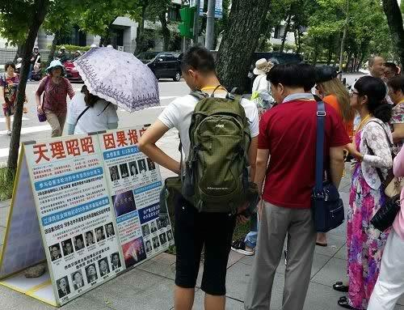

  

# 神州明见畅游真相精简阅读版
---
简介文字

# 精选文章  	 

	
## 向无神论说再见

【明慧网二零二三年一月二十六日】文: 傅杰

一月二十日，中国新年前夕，法轮功创始人李洪志大师在明慧网上刊登《为什么会有人类》一文，并同时授权大纪元、新唐人电视台面向更多的世人发表该文。
李大师的这篇文章石破天惊，句句天机，开篇即谈到：“过年本应讲几句大家喜欢听的年话，但我看到的危险在一步步逼近人类。为此众神、佛要求我向世界众生说几句神要说的话，句句天机，为的是叫人知道真相，再给人得救的机会。”

依笔者个人理解，李大师的话透露了人类即将面临更大的危险，展现了神佛的悲悯与李大师的洪大慈悲。

看看这世界，先不谈什么俄乌战乱与台海危机、地缘政治纷争与世界经济衰退、环境恶化气候变暖、性乱毒品黑社会等，单单这个中共病毒，全世界已经死了近700万人，中国那块党文化乌烟瘴气的土地上，疫情灾难是创历史记录的，一药难得、一床难求、一葬难有，很多阳过的人还可能留下后遗症，中共却继续给自己唱赞歌、极力掩盖死亡数字。李大师揭示中共三年动态清零期间，已经有4亿人死亡。有些人可能质疑这个令人心惊的死亡数据（本文先不做论证），看看中共的反应就知道了，到目前为止，中共无力反驳，砖头砸在谁的脚上谁知道疼。

**瘟疫肆虐，无神论能施展救赎吗？**

放眼世界，人类也只能寻求“与病毒共存”，奢谈消灭。

中共搞了三年所谓的“动态清零”，消灭了病毒了吗？没有。突然放弃“动态清零”，是因为各地疫情纷纷爆发，再也掩盖不住了。中共不是号称科技大国吗？投入巨资发展核弹头、太空武器、5G、人工智能、监视头、健康码、大数据等穷兵黩武、监控百姓的科技新兴项目，都是在把人类、中国人当作自己的敌人在消灭。面对萨斯和武汉肺炎，中共的科技无计可施，只是持续地把所谓的前沿科技着力在掩盖真相上。

现有科学发现，病毒无处不在，地球上仅细菌病毒的总质量就超过了所有大象重量的1000倍；在全世界的供水系统中存在的噬菌体颗粒超过1030个，将它们从头到尾排列起来长度超过2亿光年；目前地球上的HIV（艾滋）病毒基因组有1016个，科学家们推测这其中很可能存在针对现有的或将来的抗病毒药物都具有耐药性的基因组。

面对病毒、基因组与蛋白质，科学的突飞猛进，是在证明科学是巨人还是小矮人？无神论貌似那么强大的思想武器，在病毒、瘟疫面前，起到了多少救赎作用？科学哲学告诉我们，科学越强大越反证科学的无知，而无神论将人类大规模疫毙于病毒的责任推卸给了大自然和人类所谓进化过程中必付的代价。

其实“无神论”一词最早起源于公元前五世纪的古希腊语，最初指的是对较广为接受的神灵所持有的否定态度的人，背叛和亵渎神而被神灵抛弃的人，或未承诺相信某种神灵的人，而不是现代科学主义语境下的对神的全盘否定。随着中世纪的结束，近代科学怀疑论、工业革命和启蒙主义兴起，“无神论”一词的语义被放大，到法国大革命，共产主义登陆人类时期，无神论被共产主义者们进一步裹挟、利用，成为共产邪灵暴力革命的理论支撑，继而成了政治运动的关键性基础性理论。

无神论的欺骗性在于它将人类的认知局限性（未解之谜）一次性打包交给了人类局限性（未解之谜）自身，并将这个错误的路径指向了遥远的未来，将答案许诺在未来中。这就像一个靠借债度日的混混，债务违约日期到了，就拆东墙补西墙，债务越滚越大，日子却自欺欺人地得过且过，但总有一天债务要爆发的。从这点上来看，无神论理性吗？真的科学吗？

**中共反神，无神论走向末路**

中共邪灵百年来好话说尽，坏事干绝。中共诬蔑蒋介石国民政府为“反动派”，可蒋介石一家老老小小都信神。祖父蒋斯千早年信佛、中年修行后潜心归入佛门。母亲王彩玉一生茹素拜佛，手不离经，晚年皈依佛门。蒋介石精通王阳明心学，和太虚法师多有交往，崇敬佛法。后来蒋介石又熟读《圣经》。蒋经国在抗战的重庆政府时期就经过了洗礼。当时国民党中的干将高官有不少人不仅学贯中西，而且崇佛信神。宋美龄一家更是基督教世家。被中共刻意曲笔污蔑的民国大军阀，如段祺瑞、孙传芳、吴佩孚等人，不仅品行端正、为人保守传统，而且个个信佛崇佛。一九一七年段祺瑞二造共和讨伐辫子军张勋时，手下皖系军阀要多杀人，段祺瑞呵斥说，赶跑了就行，杀那么多人干什么？杀人要造孽的。

中共却是彻头彻尾的反神邪灵，建政后三教齐灭，让僧人还俗，强迫僧尼结婚，文革时砸佛像、毁寺庙，天宇中无数神灵怒视着。中共历届无神论党魁漠视生命、嗜血成性。毛泽东一九五七年要打核大战，死3亿人不在乎，大饥荒、文革死亡近8000万中国人。邓小平说杀20万保20年。江泽民对法轮功信仰者大开杀戒，迫害死数百万大法弟子，还活摘法轮功学员的人体器官。习近平将中共恶党红旗党旗插到寺院，三年疫情，漠视中国人生死。

在人类走向末法末劫的今天，新冠病毒瘟疫伴随着人类道德败坏、背叛神灵，迫害法轮大法正信信仰的罪业积累，正在横扫人类，尤其是死心塌地跟随中共的邪党分子，迫害过大法弟子死不悔改的，都是瘟疫逐个消灭的对象。近期在大陆开放后的疫情海啸中，失去生命的人大多都受到了无神论的毒害。

无神论再也欺骗不下去了，是时候该拔除了。

**解救之道**

人类史上历次大疫并非无差别传染，总有神异与奇迹，古罗马四次大瘟疫，基督教徒出生入死救死扶伤却少有染疫，明末鼠疫剑指明军明人，却绕过密接者清军。

而此次中共病毒呢？不谈远的，就谈笔者了解到的情况。平时对中共比较反感的，对法轮功比较友善的，我发现这些人有的到现在也没阳，或者阳了几小时就过去了。有个小朋友上小学时就坚决不戴红领巾，这在大陆可是很难做到的，这次疫情，几乎是无症状就过去了。再者，就是办了三退的人，家人都阳了，他没阳。有个两口子，都信基督，都打疫苗了，妻子阳了，老伴没阳，老伴三退了，妻子目前还没三退。

还有些没打疫苗的，当中也有没阳的，在大陆没打疫苗的基本都是不信中共且能抵抗得住中共施压的人。上述三种人具有相当强的免疫力，瘟疫绕着走。这三种人有共同的特征，就是远离中共，对法轮功友善。

笔者理解，李洪志大师早在三年前就曾开示世人，瘟疫是冲着中共而来。此次李大师发表《为什么会有人类》，是提醒三年前没重视那个开示的人，给本已业债累累的地球人类走向未来的生机。

朋友，您好好想想，无神论能让您守住善良、得到神的庇护吗？不能。您真是一个没有神性的人吗？回答应该是否定的。完全不信神的人，什么业都敢造，不想因果，不知作恶会招报，他们是不给自己留生路的可悲之辈。
## 瘟疫中如何自保

2020 年初，武汉肺炎疫情在中国爆发并蔓延到世界，有专家指出“此次武汉肺炎疫情比2003年非典严重十倍”，然而从疫情出现以来中共一直隐瞒真相，甚至瞒报死亡数字。

人们计划中的走亲访友、大聚会、度假游也受疫情影响，很多人选择闭门不出，专家也告诫人们要戴口罩、多喝水、勤洗手。不过，这只是让大家做好防护，维护公共卫生安全，而真正让您躲过灾难的却是法轮功学员告诉您的三退（退出中共党团队）和九字吉言：“法轮大法好，真善忍好”。	

只要您发自内心的念诵“法轮大法好，真善忍好”，就会起作用。先说一件真实的事《不怕瘟疫的人》。

一位沈阳人在今年1月2日去逛当地的一个大型超市，人山人海的，当天傍晚他就开始咳嗽，第二天就发烧了，不想吃东西。没料到症状越来越严重：发烧让他躺在床上起不来，好象内脏都肿了，呼吸困难，咳嗽得很厉害好象要吐血了，全身的骨头都痛，头也痛，还有麻木的感觉，盖着厚厚的棉被还感觉冷！

尽管这样，他却一点没有害怕，因为他心里装了救命的法宝：他就开始念“法轮大法好，真善忍好！”他一遍一遍的坚持念，结果发烧烧了四天以后，就不烧了，后来只是咳嗽，身体没力气。他没有告诉亲人，是怕亲人们担心。结果，两个星期以后，他就彻底好了。

他说：“自从我明白法轮功真相，并退出中共的团、队组织后，再也不怕什么疾病、瘟疫和灾难了，因为我知道了无数的人因敬念“法轮大法好，真善忍好”而绝处逢生，知道了法轮功来到世间是来救人的。”

他还说：“我知道，其实不只是我，所有把“法轮大法好，真善忍好”这九字真言记在心里的百姓们，都会不害怕瘟疫，也不会害怕灾难，因为与神佛站在一起的人，都会得到神佛的保护，都会拥有美好的未来。”

法轮大法教人按照“真、善、忍”做好人，而且对祛病健身有奇效。至今，已经洪传全世界100多个国家和地区，获得多国各级政府的褒奖、支持决议和信函超过3000项。法轮大法的主要著作《转法轮》一书，已经被翻译成40多种语言在世界各地发行。法轮大法的创始人李洪志先生四次获得诺贝尔和平奖的提名。在香港、澳门、以及台湾都可以自由的修炼，仅仅台湾就有70万人在修炼法轮大法。

世人诚念“法轮大法好，真善忍好”，就会得到大法的保护，从而远离灾祸、逢凶化吉，转危为安。有人念后癌症好了，有瘫痪的病人念后能走路了，有重大车祸安然无恙的，还有躲过了地震、爆炸、海啸、洪水等等大劫难，遇难呈祥的。

在中国的传统文化中，向来有敬天畏神，相信天灾人祸是上天在警示人。中共自窃国以来坏事做绝，罪大无边，不断发动运动，三反、五反、反右、文化大革命、“六四”屠杀大学生、再到迫害法轮功、活摘法轮功学员器官，在和平时期杀害了八千多万中国人。

这次，中共刻意隐瞒肺炎疫情，导致疫情大爆发！人在做天在看。中共罪恶滔天，人不治有天治！

那么天灭中共的时候，曾经发过毒誓说要把自己的生命献给中共，为它奋斗终生的党员、团员、和少先队员们，就会随着自己发过的誓言成为中共的陪葬品。已经有3亿5千多万中国人在海外的退党网站上声明了退出党、团、队组织，就是三退保平安。希望您和家人能尽早三退，三退后的生命就远离了厄运，神佛就已经悄然而至，保护着您了。您用真名、小名、化名都可以，写在一元纸币上，或写在纸上贴出去，神看的是人心。宁可信其有，不可信其无。

希望在这场发自武汉、波及全球的凶猛瘟疫过后，您和所有真心向善的人一样，依然生活在这片土地上，彼此善待，安居乐业。
## 给有缘人的一封信

**朋友：您好！**

大千世界，茫茫人海，您知道吗？能看到这封信和资料，您是多么幸运啊！有句话说：危险并不可怕，可怕的是，当巨大的险情来临时却不知道，这才是最让人痛惜的。我们衷心祝愿您与家人都有一个美好的未来，希望您能全家幸福平安，远离危险！

**您看过关于“预言”的书吗？**

中国被称为神州，中国文化有“神传文化”之称，这在全世界是独一无二的。预言是神传文化的重要组成部分，中国许多朝代都留下了传世预言，对历史有着惊人的准确预测。比较著名的预言包括：周朝的《乾坤万年歌》，汉代诸葛亮的《马前课》，唐代李淳风的《推背图》，宋代邵雍的《梅花诗》，明代刘伯温的《烧饼歌》等。在外国比较著名的预言有：圣经《启示录》，法国诺查丹玛斯留下的《诸世纪》，韩国的《格庵遗录》等。众多的预言，出自不同的文化和地区，跨越不同的时代，却都预言了中国的朝代更迭、中共的产生与灭亡，及人类此时将有大劫之忧，预言了即将在中国发生的一件惊天动地的大事：天要灭中共，以及天灭中共时其追随者将被一同诛灭的可怕惨景！

**亿年藏字石现天机**

2002年6月，在贵州省平塘县掌布乡发现了2.7亿岁的“藏字石”，五百年前崩裂的巨石断面内惊现六个排列整齐的大字“中国共产党亡”，其中那个“亡”字特别的大。中国的各路地质专家经实地考察后一致认为，这“藏字石”上未发现任何人工的痕迹，乃天然形成，堪称世界奇观。国内多家媒体报道，但都隐去“亡”字。“藏字石”的图片还被赫然印在贵州“藏字石”风景区的门票上。（见上图）

冥冥之中有天意。史料上也有关于“藏字石”的记载：秦始皇36年，有坠星下东郡，至地为石，其石刻曰“始皇帝死而地分”。果然，秦始皇死后，秦二世即位不久，秦朝就灭亡了，准确地应了天意。千百年来的中国，在要出大事之前就一定有奇事发生，老天或以瑞兆示吉，或以凶相警世。今天，贵州平塘的“藏字石”是否也在向人们预示着天机呢？《易》曰：“天垂象，见吉凶”，由此看来，亿年古石崩裂，突现“中国共产党亡”，非同小可，天意昭然。中共恶贯满盈，坏事干尽，天真要灭中共了。

**《九评共产党》掀起退党潮**

2004年11月19日，海外媒体大纪元新闻网开始发表系列社论——《九评共产党》。《九评共产党》是第一次系统阐述共产党邪恶本质的旷世之作，极短时间内便在海内外引起了强烈反响，被迅速翻译成三十多种语言在世界各地发行传播，被称作是“一本震撼全球华人的书，一本正在解体共产党的书”，并由此引发了势不可挡的全球退党、退团、退队——“三退”大潮。截至2016年9月，已经超过两亿五千万各界人士声明退出中共党、团、队组织，而且正以平均每天约十万人的速度滚雪球似的递增……退党大潮在中国产生了巨大的影响。这是中华民族的精神觉醒，是对中国人的心灵救赎。当人们认清中共恶党的本质后，就会猛醒退党保命。古语云：“君子不立危墙之下。”退出中共邪党，是顺应天意，是选择善良、远离邪恶，不做邪党的殉葬品，也为自己选择了光明的未来。

**为什么灭中共是天意？**

中共建政以来，周期性的政治运动迫害了中国一半以上的家庭，造成了8000万中国同胞丧生，这一数字超过了两次世界大战死亡人数的总和。接二连三的各种血腥政治运动，镇反、三反、五反、肃反、反右、荒诞的大跃进和相继而来的三年大饥荒、反右倾、四清、文革、“六四”镇压学生、迫害法轮功，等等等等，无数善良人成了中共的虐杀对象。中共血债累累，罪恶滔天，必遭天谴；再看当今的中国社会，贤良受辱，小人猖獗，世风日下，道德沦丧、信义无存，黄赌毒假泛滥成灾。工人失业，农民失地，贪官横行，官商勾结，警匪一家，民怨沸腾……中共祸国殃民已经到了如此地步，人神共愤，上天还能容它吗？！

共产党一向与天与地与神佛为敌，宣称无神论，战天斗地。文化大革命中，消灭一切宗教，煽动老百姓砸佛像，毁寺庙。2001年初，江泽民集团一手导演“天安门自焚”假案嫁祸法轮功，用中共控制下的“一言堂”媒体愚弄不明真相的百姓，煽动群众对以“真善忍”为原则的法轮功修炼者的仇恨，而这场迫害完全是由血腥和谎言构成的。

**“天安门广场自焚”真相**

国际教育发展组织（IED）早在2001年8月14日的联合国会议上就提交了天安门自焚案的分析录像带，谴责江泽民集团的“国家恐怖主义行为”，并发表正式声明称：“中共当局企图以诬陷法轮功残害生命、破坏家庭来为其国家恐怖行为辩护。我们的调查表明，恰恰是中共当局对法轮功修炼者的虐杀而导致其家庭破裂，残害生命的正是中共极端残暴的酷刑、精神病院的摧残、劳改营的奴役……中共当局企图以自焚事件为证据诬陷法轮功，而我们得到的录像分析表明，整个事件是中共当局一手导演的。我们有该录像的拷贝，有兴趣者可来领取。”中共代表面对确凿的证据，没有任何辩辞。该声明已被联合国备案。

天安门自焚伪案漏洞百出：王进东的衣裤被火烧破，头发却完整，两腿间盛汽油的塑料瓶在火焰下竟不变形。王进东身边的警察拎着灭火毯晃悠、摆姿式等着拍戏。

※注：因早期播放的自焚录像被指出多处漏洞，在2001年8月中共对“自焚案”审判过程中播放的自焚录像中剪切掉了所有被指出的可疑之处。刘春玲被警察用重物击打头部倒下的镜头片段，已不见踪影。而这恰恰是不打自招，欲盖弥彰！造假背后必定是骇人的阴谋！

所有“自焚”伪案的参与者，不管他们动机如何，他们的命运都是苦涩和令人悲哀的。他们失去的，或者是自己宝贵的生命，或者是自己的道德良知。

除“天安门自焚”伪案外，2006年初又揭露出来的“中共集中营、劳教所、监狱活体摘取并盗卖法轮功学员器官和尸体牟取暴利”的罪行，其残暴程度远远超过了人类道德良知的底线，是“魔鬼的行径”、“是全人类的耻辱”、是“这个星球上前所未有的邪恶”。天良丧尽的中共邪党被天惩、解体的命运已成定局。

**迫害元凶江泽民等被国际起诉 大审判在即**

自2000年起，海内外法轮功学员以“群体灭绝罪、酷刑罪、反人类罪”在全球30多个国家，发起50多个刑事和民事诉讼，控告迫害元凶江泽民及其帮凶，被称为“21世纪最大的国际人权诉讼”。2012年10月30日，“清算江泽民迫害法轮大法国际组织”成立。2015年5月以来，在国内受迫害的法轮功学员及其亲属和各界民众，纷纷依法控告、起诉迫害法轮功的首恶江泽民，日益高涨的全球诉江大潮势不可挡…… 

“善恶到头终有报”。天惩的序幕已经拉开，中共正在走向全面崩溃，迫害者恶报连连。王立军、薄熙来、李东生、周永康、郭伯雄等曾不可一世的迫害者纷纷落马，江泽民、罗干、曾庆红等元凶和罪无可赦的迫害者被彻底清算也正在逼近。中共体制内觉醒的官员和警察，已经开始留后路并私下收集文件、保留证据，退出中共，不再参与迫害，保护法轮功学员，并向国际社会公开其他官员的犯罪证据，揭露迫害法轮功的真相，在历史巨变的关头为自己和亲人选择光明的未来。江泽民对法轮功的迫害政策已众叛亲离，穷途末路。江泽民、罗干、刘京、周永康以及所有不思悔改的恶人面临的是历史的大审判！

**三退保平安**

中共灭亡是必然的。历史曾经有过深刻教训，强大的罗马帝国无人可以征服，就因为罗马皇帝采用谎言、造伪证嫁祸于基督徒，借此对基督徒进行残酷迫害，结果招致天惩，国家灭亡。杀人偿命是天理，中共欠下这么大的血债，怎么能不偿还呢？那么到上天清算中共邪党的时候，作为它组成部分的党员、团员、少先队员就会成为中共的陪葬品一同毁灭。所以，人要想保平安，只有退出中共的党、团、少先队组织。

有人可能说：“我思想中早退了，我也早就不交党费了。”但那是不算数的。您知道吗？你加入党、团、队时，在血（红）旗面前发了把生命献给恶党的毒誓，就是把生命交给它了，就被打上“兽记”，就是恶党的一员，你不声明退出，就抹不掉“兽记”， 当中共被清算时，所有未声明退出、仍带有“兽记”的党、团、队员就会遭殃。

也有人可能说：“我早就超龄自动退队或者退团了，不必走形式了。”但这种所谓的自动退队、退团的形式那是人世间的中共组织形式认可的，不是神认可的。所以凡是曾经入过党、团、队等组织的人都要主动声明退出来，有行为的表示，才能除掉这么大的毒誓，神就会帮你抹掉“兽记”，您才能在天灭中共的时候保性命、保平安！

那么如何退出中共的党、团、队组织呢？只要登录海外的“大纪元”退党网站声明退出参加过的中共组织就可以了，也可找你认识的法轮功学员帮忙代理。暂时不能上网声明退出的，可将“退党（团、队）声明”张贴到适当的公共场所、或写在钱上花出，同样有效，待有条件再上网发表声明。人们用真名、小名、化名、笔名或自己认可的名字声明退出党团队都可以。因为人在做、天在看，而且神看人心，慈悲于人，广救众生，既保护人又予人方便。

古人云：宁可信其有，不可信其无。说一声“退”你毫发无损，也不费一分钱，却得到了个生命大保险，何乐而不为呢？！爱自己的家人，那么就劝父母、妻子、儿女、亲朋好友也都退了。在世上，没有比真理和生命更可贵的了。请用良知为自己的生命做出明智的选择！

**珍惜生命 选择美好未来 **

朋友，请你冷静地思考一下法轮功。时至今日，中共对法轮功的血腥迫害已持续二十一年，法轮功不但没有倒下，却传遍世界100多个国家和地区，使不同国度、不同民族亿万人受益。至今，法轮功获得世界各地的褒奖与支持议案、信函已超过3000项。

古语“大德曰生”，顺天保命。朋友，当您与亲友能在大灾难中平安脱险、幸存下来的时候，一定会为接受今天的建议和提醒而感到万分幸运，切勿失去这个宝贵的机缘，瞬间即逝啊！ 

最后祝您及家人、朋友：三退自救保平安，幸福永相伴！
## 中共祸害中国 三退才有未来

2018年7月15日，吉林省长春长生生物公司因为狂犬病疫苗记录造假，遭食药监局通报。谁料三天后，该公司再被披露其预防婴幼儿百日咳、白喉、破伤风的百白破疫苗被验出不合格。事件曝光后立即轰动全国，一时间“疫苗”成为引爆民愤的敏感话题，而且黑幕越揭越多。

当今做人难，做中国人更难。除了雾霾、毒奶粉、毒食品，现在还出现毒疫苗！直接毒害我们的下一代！当这个社会连小孩子都保护不了，这个社会还有何希望？更别说社会上黄赌毒，无官不贪……这一切的背后，都离不开道德危机、诚信危机和信仰危机。

中华五千年文明，任何一个朝代灭亡时也没有混乱到如今这种地步。中国的今天究竟是谁造成的？今天的中国与历史上各个朝代有什么不同呢？

事实上就是共产党执政之后，不断地搞政治运动，三反、五反、镇反、反右、文化大革命、六四天安门、迫害法轮功等等等等，据《九评共产党》一书估计，约有八千万中国人被共产党直接或间接害迫害致死。

尤其是99年到现在，中共对法轮功的迫害尤为惨烈。以吉林省为例，据不完全统计，吉林省迫害法轮功的案例8205例，迫害致死475人，名列中国迫害法轮功最严重省份的前五名。长春则是吉林省迫害最严重的城市。吉林省有3358名公检法司、教育界、媒体界等人员因迫害法轮功学员，被海外组织“追查国际”立案追查。自迫害以来吉林5任省委书记中，王云坤患癌症死亡，王珉、孙政才被判无期徒刑， 王儒林调任闲职，知情人说是因为迫害法轮功遭了恶报。

法轮大法是佛家修炼的上乘功法，学炼者以“真、善、忍”为原则要求自己，因为祛病健身，提升道德的水平卓著，已传播到了世界一百多个国家和地区，唯独在中国受到残酷迫害。中共建政以来对传统文化和道德的系统破坏，对“真、善、忍”信仰价值的打压，是造成当今中国社会道德急速下滑，道德底线一再崩溃的重要原因。

《九评》编辑部出版的新书《共产主义的终极目的》对此有深刻的剖析，明确指出共产党对中国及全世界的危害性。再这样沉沦下去，我们热爱的这片土地，我们的下一代真的就没有希望了。有人可能说，现在中共大力反腐，不是有希望吗？不是的，因为反腐只能制表而不能治根。中国社会的危机是中共体制造成的，不然今天就不会发生触目惊心的毒疫苗事件。推荐朋友们阅读《九评共产党》及新书《共产主义的终极目的》，里面有详细的阐述，天机尽在书中！

历史的安排有定数，就象苏联解体一样，瞬间发生；中共就象一棵烂了根的大树，说不定哪天就倒了。朋友，您做好准备了吗？ 已经有三亿一千多万中国人选择退出党、团、队，又称作“三退”。您是一个有良知的好人，从思想上脱离它，是良知道义的选择，请作出您的选择吧！

三退非常安全，用小名、化名或真名退都可以，不是让您在组织里退，头上三尺有神灵，这是上天给每个人一次选择的机会。有人说我早就超龄自动退了，或我不交党费不算党员了，可是那不是您主动的选择，上天并不认可，每个人都要自己选择，要有行动才行。

祝您早日选择光明与善良，有个美好的未来！
## 中共不是中国 退出中共才有未来

当我们提到中国，会想到中华传统文化，文物古迹，风土人情，但绝不会是一个政党。政党与国家和民族不是一个概念。

中国作为一个国家，一个民族已经存续了几千年。而中共的统治中国也不过才六十多年。中共当然代表不了中国。

同为中国人，我们都为自己国家的悠久历史，博大而精深的传统文化感到自豪。但自从引进了与中国传统格格不入的共产党，从此给我们带来的都是灾难。共产党一直用“假、恶、斗”来维持统治，害死了八千万中国百姓。镇反、三反、五反、肃反、反右、大跃进、文革、六四镇压学生、迫害法轮功等等运动，无数善良的中国人成为中共虐杀的对像；中共破坏中华传统文化的精髓“儒释道”信仰，导致道德体系全面崩塌，社会乱象层出不穷；中共卖国，从1949年以来，中共主动放弃的领土多达数百万平方公里。

有人说了：我也知道它不好，但是共产党给我钱。朋友您想过吗？您得到的那份钱，是您自己工作，付出而换来的。也许您付出同样的努力，在西方国家，您得到的金钱和待遇会更好呢。中共是世界上最大的腐败党，恰恰是中共贪污了您应该得到的钱。

在今天的中国，伦理道德被破坏惨重，假货泛滥，娼妓遍地，毒品复燃，官匪勾结，黑社会横行，贪污腐化泛滥猖獗，而法轮大法提出的按“真、善、忍”的标准做好人，是我们最后的希望了，世界一百多个国家和地区都可以自由的修炼。您突破中共的网络封锁就可以在互联网上免费下载所有法轮功的书籍和音像资料。

中共还把被非法关押的法轮功修炼人当作活体器官库，从他们身上强摘器官。就是不打麻药，把他们的心脏、肝脏、肾脏、眼角膜等器官活活切下来做器官移植赚钱。而被活摘器官的法轮功修炼者，在这个痛苦的过程中悲惨的死去。中共罪恶滔天。可是却要求每个中国人都发誓为它所干的事奋斗终生，也就是说中共在把它的罪恶分给每个党员、团员和少先队员一份，拉他们作陪葬。这不可怕吗？

到二零一八年二月，已经有三亿多中国人看明白了真相，选择退出了中共的党、团、队组织。不是在组织内退，是在海外的退党网站声明退出。用小名或化名也可以。上天看的是人心，无比珍惜您可贵的生命。您“退出中共”这一念，就能让您从此得到神佛的保佑。
## 国际社会发声：停止迫害法轮功

2019年7月24日讯：法轮功和平反迫害20周年之际，美国国会及行政当局中国委员会（CECC）发布一份声明，要求中共停止迫害法轮功，立即无条件释放被关押的法轮功学员，并要求中共允许国际社会对法轮功所遭受的迫害进行独立和透明的调查。

声明中指出：“在过去20年里，中国的法轮功学员经历了令人震惊和不可接受的人权虐待。”

“在这个悲伤的周年纪念日里，中共应停止迫害法轮功，允许联合国对过去20年来法轮功所遭受的人权侵犯进行独立和透明的调查。”

7月17日，美国总统川普在白宫会见了27位信仰自由受迫害者，包括法轮功学员张玉华。张玉华告诉川普总统，活摘法轮功学员器官仍在发生着，她请求川普总统帮助制止中共政权发动的这场迫害，川普总统对张玉华女士连声说：“我明白。”川普总统说：“你们所承受的痛苦是大多数人无法承受的，我要向你们祝贺，我很荣幸能跟你们在一起，我将永远与你们并肩站在一起。”

二零一九年七月十七日下午，美国总统川普在白宫会见来自十七个国家的二十七位宗教迫害幸存者。图为川普总统与来自中国的法轮功学员张玉华女士握手。

7月16日至18日，第二届全球宗教自由部长级会议在美国首都华盛顿举行，美国副总统彭斯表示：“美国人民永远坚定地与有信仰的中国人民站在一起。”美国国务卿蓬佩奥指出，“中国正发生着这个时代最恶劣的人权侵犯行为，是本世纪的污点！”

美国众议院议长佩洛西表示，中共对人权的迫害是“对全世界良知的挑战”，“如果我们不为中国的人权侵犯和宗教迫害发声，就没有道德立场去讨论世界上其它地区的问题。”众议员杰克逊·李在法轮功学员的集会上指出：“正如马丁·路德·金的名言所说，‘任何一个地方的不公正，都威胁着其他地方的公平与公正’，你们遭受不公就是对我们不公，你们不放弃也意味着我们不放弃。”“只要我们还在，我们就将不再允许这种罪行持续下去。”

据明慧网二零一九年七月二十一日报道：在反迫害二十周年之际，法轮功学员近日将一批恶人名单递交美国国务院，要求根据相关法律将其列入特殊名单，对其拒发美国签证、禁止其入境。

国务院官员告知，名单收悉，会审核所有提交之个人，依法处理。还告知，近年在中国有多人因迫害人权被拒发签证，且皆因迫害法轮功学员。国务院官员还说明，人权迫害者的配偶、子女亦在惩罚之列。还强调，他们不看重迫害案例的数量，而看重具体事实，只要某恶人有一个案例具备足够的具体事实描述，就可将其放入特殊名单。

国务院官员称，相关办公室的人员已扩充一倍，以便加大力度审核、限制各国人权迫害者的签证申请。而且，目前有28个国家已经制定或准备制定类似于美国的“马格尼茨基法”，对人权迫害者拒发签证、冻结海外资产。

2015年12月17日，美国参议院通过《全球马格尼茨基人权问责法》，2016年12月23日附加于年度国防授权法中成为法令。该法案授权美国总统，可以对任何非美国公民实施制裁，包括禁止入境、冻结相关个人（或组织）的财产。制裁对象为：对迫害人权负有责任的政府官员、其代理人、非政府协力人员；有严重腐败行为的官员；为上述人员提供便利的或转移其非法收入的或提供其它技术支持的相关人员。

从2000年起，法轮功学员在中国大陆、美国、加拿大、阿根廷、德国、西班牙、荷兰、南非、澳大利亚、韩国、台湾、香港等二十多个国家和地区，包括国际海牙法院，起诉江泽民。2015年5月至今，全世界已有21万法轮功学员实名向北京最高法院、最高检察院控告江泽民，已有303万人签名向“两高”举报江泽民。

中国问题专家横河先生表示，作为人类历史上最邪恶最极权的中共，建政后迫害了无数中国人，迫害法轮功却彻底失败，使自身陷入了四面楚歌的境地。

中国在二零一九年再次被美国国际宗教自由委员会列为侵犯宗教自由的“特别关注国”，这是中国连续第二十年被列为“特别关注国”。

中国有句俗话：“多行不义必自毙”，“法网恢恢，疏而不漏。”内忧外困、四面楚歌的中共目前的处境，无疑被罩在了天罗地网之中，等待它的必定解体灭亡的下场。
## BBC报道揭中共迫害法轮功与活摘罪行

一个月以来，英国国际广播公司记者马修·希尔的专门调查“发现：中国的器官移植”成了BBC电台、电视热播节目，反复播出的节目中，希尔和BBC的多位主持人围绕两个问题穷追不舍：“中国器官移植的来源到底是什么？”，“活摘法轮功学员和其他良心犯器官停止了吗？”。

二零一八年十月十五日和二十二日，记者马修·希尔的专门调查节目“发现：中国的器官移植产业”在BBC电台分两期播出，节目题目分别是“该相信谁”和“（器官）旅游和透明度”，两期节目在BBC电台反复播放。

**否定不了的指控：中共仍在活摘法轮功学员和其他良心犯器官**

中共是否仍在活摘法轮功和其他良心犯器官，是马修·希尔调查的主线，也是焦点。他采访了因坚持信仰曾受到中共非法拘留监禁的法轮功学员杨女士和刘先生，请他们讲述遭受中共迫害的经历，特别是被定期强迫身体检查的具体过程，并把两位法轮功学员的讲述作为重要调查内容播出。

安妮·杨这样回忆她在二零零五年被非法关押在北京劳教所里的经历：“我被严重迫害，肉体上和精神上，同时，他们把所有的法轮功学员带到最近的医院，每三个月一次定期的进行身体检查，包括胸透视、肝检查，包括B超和血液检查。”，“这些医院属于公安部门，离劳教所很近。”

去年结束被非法关押的法轮功学员刘先生披露说：“我在监狱里的时候被带到医院好几次，被抽血验血，不但是我，所有的法轮功学员，他们强迫我们放弃信仰，你不听从，他们就毒打你，打你的胳膊和腿，打你的臀部，但不碰你的器脏部位。”

在播出的“影响（Impact）”电视节目中，连线互动一开始，马修·希尔首先向主持人解释中共为什么要迫害良心犯、迫害法轮功：任何在国家控制之外的人、任何少数群体，都会被中国共产党视为威胁。一九九九年，法轮功学员达到一亿人，就被（中共）认为是巨大威胁，就被共产党污蔑诽谤，接下来就是对他们大规模的拘押。其后联合国机构注意到在拘留中心（中共）滥用酷刑对待坚守平和信念的法轮功学员。

马修·希尔特别引用前加拿大外交部亚太司司长大卫·乔高、加拿大人权律师大卫·麦塔斯和美国资深媒体人伊森·葛特曼有关中共活摘良心犯器官的独立调查结果，让他们在BBC电台节目“该相信谁”里发声，提醒民众中共迫害良心犯最终目的不是赚钱，而是要对良心犯群体进行冷酷的群体灭绝：

大卫·麦塔斯说：“中国官方统计死刑犯人数在下降，而开展器官移植的数量在上升；同时，在中国，存在着成百上千个关押良心犯的拘留中心。”，“等待时间短，患者想什么时候来就什么时候来，几乎马上可以得到供体，这意味着有人因此被谋杀。”

大卫·乔高说：“你要是被当作国家的敌人，你的生命就不值钱，西藏人、维族人、家庭教会基督教徒，特别是法轮功，有大量的报告。”

伊森·葛特曼说：“这是严肃的指控”，“是（中共）国家要消灭‘敌人’，钱只是用来做刺激的。”

马修·希尔这样总结自己的调查：我们不会停止怀疑中共仍在活摘法轮功学员和其他良心犯器官，中共官方所称器官供体来源数量（中共声称从二零一五年起停止使用死刑犯器官、目前器官移植主要依赖死于重症监护病房病人的器官）与发生在中国的实际器官移植量之间落差大，由于缺乏透明度，中国移植旅游市场的器官来源仍然是谜。因此，我们不会停止怀疑中共仍在活摘法轮功学员和其他良心犯器官。

**法轮功是什么，中共为什么打压法轮功？**

BBC播出镜头中出现法轮功学员在伦敦中使馆前坚持和平抗议的真相展板

在播出的BBC节目中，马修·希尔提到有关法轮功的基本信息。结合法轮功学员在伦敦中使馆前坚持和平抗议的电视画面，希尔说：“法轮功是结合打坐的精神运动 ”，但是却被中共说成非法。

十月十五日首播的“该相信谁”BBC电台节目入选听众“本周喜爱节目”，其中有一段这样介绍法轮功：“一九九九年，在中国修炼法轮功的人发现自己成了被怀疑打击的对象。法轮功运动最初是气功和打坐，在中国全社会广泛流行开来，成为中共系统控制之外的一个最大规模的群体，他们不该成为被中共政治打压的对象，难以想象从事平缓运动的这些人怎么会造成对国家的严重威胁。但是发展的规模让中共政府感到害怕了，上亿人开始修炼，很多人被打压，被送进劳教所和监狱多年，强迫他们放弃自己的信仰。由于他们不抽烟不喝酒的健康生活方式，他们被当作国家活摘器官生意的牺牲品，他们与其他宗教信仰团体一起，包括基督徒和维族人等，都成了（被中共）谋杀的对象。”

**参与“活摘”医生揭露中共洗脑迫害**

在十月八日BBC电视“全球（Global）”节目中，原新疆医生安华·托蒂又一次详细讲述他在一九九五年亲自经历的从死刑犯身上活摘器官的梦魇过程，随后BBC主持人问他：“作为一个职业医生，你怎么能做出来（杀人摘器官）呢？”安华·托蒂回答：“我们生在那个年代，被严重洗脑了，当时相信我们做的一切都是为了祖国，把消灭（中共指定的）国家敌人当作是自己的责任，被国家（共产党）判死刑的人是坏人，所以我们没有负罪感。　”

马修·希尔以他和安华·托蒂的以下对话开始BBC电台节目：

记者：“那你为什么要动刀割？”

安华·托蒂：“因为我被命令割下他的肝脏和两个肾脏。”

记者：“你不能不听这个命令吗？”

安华·托蒂：“不能，生活在中（共）国，每个人为‘国家’工作，你必须遵守命令，否则你就会被排除在社会之外，会被当作国家的敌人，你自己就会成为中共残酷迫害的对象。”

接着，一位上世纪九十年代在中国学医的男士也指出，在中共专制压迫和洗脑下，本该救死扶伤的医学界沦落到麻木不仁的状态：“我们知道移植器官来自犯人，是公开的秘密，人人知道，我们那时也听说那些犯人是被官方处决了，但并没有死，有发表的论文，医生向官方表示为保证器官质量，不要打头，打右胸，这样心脏还在跳，器官有供血，也就是说可以把器官从还在活着的身体上摘下来。”

“你怎么听说的，听谁说的？”希尔问。

“从老师、学生，还有一些医生那儿，他们知道。”

“你觉得这样做有问题吗？”希尔又问。

“当时的中共共产主义洗脑教育下，我们学生们私下议论时觉得不舒服，但能忍受这样的事发生，觉得这些罪犯怎么死都是死，医生可以得到好质量器官。”

**中国器官移植产业依然很活跃**

记者希尔在播出的调查节目中采用了韩国一家电视台对中国天津为韩国人提供器官移植服务场所的访问，用以说明中国器官旅游业的活跃现状，其中可以听到这样的对话：“我们都没有注册，也没在等待名单上，只要你有钱，就有可能活下来。”一位护士告诉采访记者，我们昨天做了一个胰脏、三个肾脏和四个肝脏（移植）。这些韩国人拿的是三个月的旅游签证。

节目中，希尔自己给广州市一家医院打电话咨询肝移植情况，被告知价格是十万美金，可以马上报告病情，然后排队等供体。

BBC记者马修·希尔当面质问黄洁夫的画面

希尔随后有当面采访被指控是活摘器官的重要责任者、原中共卫生部副部长黄洁夫的机会，直接问他：“为什么我打电话到中国医院去，很快就获得了移植肝脏的机会？这怎么可能？”黄洁夫没有回答，尴尬离去。
## 法轮功真相小问答

**问：媒体报道的法轮功学员杀人自杀是怎么回事？**

答：那些都是江泽民个人叫喊“三个月消灭法轮功”之后，大陆官方媒体传出的“信息”。但是人们不禁要问：从1992年法轮功传出以来，几年间从来没有听说过这样的事，怎么镇压后这种事才不断的“发生”？法轮功明白禁止杀生或自杀。李先生在讲法中提到：“杀生不只是会产生重大业力，还涉及到一个慈悲心的问题。”“自杀是有罪的”。一个心中装着“真善忍”的人，做事与人为善，怎么会去做那些损人害己的事呢？一个人如果嘴上说修炼“真善忍”，实际却干出与“真善忍”背道而驰的杀人害命的大坏事，那只能证明这个人根本就不是真修者。

**问：炼功不会出偏，那“1400例”死亡是怎么回事？**

答：“1400例”是全中国上下当作政治任务“挖掘”出来的，而且是不允许任何第三方的调查，更不允许法轮功学员表达自己的意见。这种“一言堂”的做法就如同文革时刘少奇被扣上叛徒、内奸、工贼的大帽子，是冤假错案。其实对于这1400例，一些当地的法轮功学员進行了调查，他们调查的案例都显示这是栽赃陷害。

即使退一万步说，假使这1400例都是真的，那么在中国有大量的人群炼法轮功，即使按照江泽民集团大大压低的数字，也有200万人。法轮功从92年传出，到99年7年间，假如死了1400人，平均每年200人，即使只有200万人炼法轮功（实际上有几千万），那么每年死亡率是万分之一。而中国人正常死亡率万分之六十五（0.65%）。所以这反而证明炼法轮功死亡率大大降低。

**问：炼法轮功会导致精神病吗？**

答：在北美和台湾有几十万人炼法轮功，却从未听说有人因炼法轮功而得了精神病。在中国大陆，有几千万人炼法轮功。江泽民政府费了九牛二虎之力拼凑了几个案例，却根本经不起推敲。因为撒谎总会出破绽，尽管撒谎已成了他们的习惯。当初他们不是说六四事件中天安门广场没有死一个人吗？现在又导演了一场“天安门自焚”骗局诬陷法轮功。凡是看过“自焚还是骗局？”录像带的人都清楚地看到，所谓的“自焚”者之一的刘春玲不是被烧死的，而是被警察用重物打死的。这说明江氏政权在千方百计为其镇压制造借口，为了政治的需要，他们是什么事情都干得出来的。如果说炼法轮功真能导致精神病，法轮功学员早就都自己放弃了，还用得着江泽民一伙花这么大力气来逼迫人放弃吗？

**问：生日问题？**

答：中央电视台指李老师编造身世，更改生日，虚构自己是“释迦牟尼转世”。但实际情况是文革中政府把生日写错了，而李老师只是请有关派出所把错了的生日改回而已。在这个日子出生的人又何止万千？李老师从来没有声称自己是释迦牟尼佛。事实上在中国，户口本上的生日被写错的例子是非常多的。《人民日报》曾登一篇有一老妇人曾为李老师接生的事，别说此80多岁接生婆拥有如此“惊人”的记忆力，她称：她清楚记得1952年为李老师接生时，是难产，用了催产素。单单她所用的催产素，在那年还未临床使用（可查哥伦比亚百科全书－－催产素发明应用日期为1953年）。

**问：炼法轮功会不让吃药吗？**

答：看遍李洪志先生的有关书籍，绝对没有一句“不准学员吃药”的话。李先生只是讲了吃药与修炼的关系。中央电视台录影带是断章取义剪辑成的，李先生原来的演讲意思是：法轮功学员不可以以气功给别人治病。然而，经过中央台的移花接木，意思竟变成说法轮功学员自己有病了不准去看。事实上，法轮功具有神奇的祛病健身功效，许多学员学炼之后，病痛消除了，所以才自动停止服药。在大陆一些修炼法轮功的医学人员曾对北京市区12731名法轮功学员進行调查，其中有11892人炼功前是有病的，炼功后11785人疾病好转或完全康复，完全康复的有6962人。没病了就不吃药了，即便是良药还苦口呢！

**问：法轮功有无敛财？**

答：所有法轮大法的书籍和影像资料，一直都可以免费从国际互联网上下载、复制，若要敛财，何必如此？《转法轮》的市场价为12元，而大陆出版一本攻击法轮功的书却卖几十元，谁在敛财，一目了然。

**问：法轮功是不是宣扬“世界末日”？**

答：中央电视台制作的“李洪志其人其事”节目中一些所谓的证人声称李老师曾宣扬世界末日等等，纯属虚构，是为了满足一些人的政治目的。李老师从来没有那样说过，而且在多次讲法当中，他一再强调只有邪教才宣扬世界末日的到来。中央电视台将李老师在录像中的一句话：“大劫难不存在了”的后半句删剪，只放了前半句“大劫难”。堂堂国家电视台如此愚弄百姓，居心何在。

**问：法轮功是不是宣扬迷信？**

答：自古以来，中国几千年的文化博大精深，宗教中所谈到对神、佛的信仰是不是迷信？许多人把目前科学还无法证实的一切，全都说成是迷信，这样科学还能发展吗？李洪志先生是以现代科学、现代人体科学的角度来讲述修炼的实质，并不是说教与唯心，在法轮功学员中有很多很有成就的人，包括大学教授、博士、科学家、社会学家、党员干部等，这现象不值得思考吗？从另一角度来看，人们对善恶因果的信仰，一直维持着人类的道德，不难想象当人什么都不信、为所欲为地什么都敢干时，社会将会如何黑暗。

**问：法轮功参与政治？**

答：法轮功学员之所以来学功是为了德行高尚、健康身体，不是来求名、求利的。李洪志先生明白的告诫学员：“一个修炼者，除干好本职工作外，不会对政治、政权感兴趣，否则绝不是我的弟子。”所以一个修炼者是与政治无缘的，是江泽民的残酷镇压将广大的炼功群众推向政府的对立面。

有人说起诉迫害法轮功学员的大陆政府官员是参与政治，我给您打个比方，假如一个政府官员杀了你的家人，你揭露他的罪行，到法庭去控告他，能说您是参与政治吗？从1999年7月20日开始后五年的时间里，江泽民一伙已经将至少1000名法轮功学员害死，我们不应该揭露、控告这伙杀人犯吗？这怎么是参与政治呢？而且法轮功学员对那些没有参与迫害的中共官员始终报以善意，即使对那些曾经参与迫害的官员也一再严肃的劝善。

**问：你们师父只是中学毕业，为什么那么多博士硕士还相信他的理论？**

答：人类历史上许多伟人的卓越成就，都不是在学校学习的基础上取得的。比如，孔子是中学毕业还是大学毕业呢？可是孔子的儒家学说在中国传扬了两千多年。禅宗六祖慧能不认字，为什么状元王维等文士那么崇拜他？只要他说的好说的对，人们就会按照他说的去做，谁还管是中学毕业还是大学毕业。美国的发明大王爱迪生也只上过小学。没有爱迪生发明电灯，大家可能还在点蜡烛照明呢。还有，钢琴神童莫扎特在演奏上可是无师自通，他3岁就开始弹钢琴，6岁作曲、9岁写交响乐、12岁写歌剧。他7岁时开始第二次为时3年半的巡回演出。这样的例子举不胜举啊。

**问：你们都不练了，不就不受迫害了吗？**

答：既然法轮功好，为什么我们就不能炼？怕遭迫害？这逻辑有问题啊！举个例子，当初日本侵略军侵略我国，搞大扫荡，和“烧光、杀光、抢光”的三光政策。抗日军民在极其艰苦的条件下前赴后继的浴血奋战，哪怕直到最后一个人，也宁可战死，决不投降。按你的说法，就该说：“你们这些傻瓜，赶快举手投降吧，为了保障人民的安全，大家都不许抵抗！当亡国奴，苟且偷生也比死了强啊。”甚至会有人说：“干脆我们学汪精卫当汉奸，还能升官发财，荣华富贵呢！”

是不是这么回事呢？这不行啊！坚持真理、坚持正义，这是做人的最基本原则啊！

**问：政府说不好，你干嘛还要炼呢？**

答：一个事物是好还是不好，并不由某个政府说了算，得由事实来说话。再者，法轮功已传遍近60个国家和地区，修者上亿，为什么只有中国一个政府说他不好，而其他国家政府都是给予褒奖？最后，也是最重要的一点，法轮功教人向善，修者身心健康，道德回升，有何不好呢？

**问：法轮功如果真的好，为什么还被禁止呢？**

答：其实迫害法轮功是江泽民一个人的决定。政府中有许多人是反对镇压的，只是不敢说或被压制下去了。江泽民说不好就不好吗？法轮功主张诚实、讲真话、尊重传统道德；鼓励人们通过实践“真善忍”来获得身心的健康与升华，人传人吸引了各阶层的人来学炼，根据中国政府在98年底的内部统计，当时全国有一亿人在学炼法轮功。这是心胸狭窄、只关心自己的权力而不顾人民死活的独裁者所嫉妒和难以容忍的。

听说过白雪公主的故事吧？即使白雪公主躲在深山老林七个小矮人的屋里，恶毒的王后都想尽办法害死她，是白雪公主不好吗？不是。是因为王后心胸太狭窄，妒嫉白雪公主太美好太善良了，反衬出她自己的丑陋和凶恶，所以心胸狭窄的她受不了。

**问：你练别的功不行吗？干嘛非要炼法轮功？**

答：既然法轮功好，为什么就不能炼？再说，练什么功是每个公民的自由，为什么一定要看谁的脸色违心行事呢？！其实，很多学员在修炼法轮功之前，确实也练过、接触过许多别的功法。他们是经过认真的思考、实践、比较之后，无不被法轮大法那博大精深的法理所折服，认为法轮功是万古难遇的正法修炼，因此最终走到法轮大法修炼者的行列中来。

**问：是不是炼法轮功的人太多，领导人才感到威胁？**

答：国家领导人首先应该考虑的是国家民族的利益，把国家建设好，使人民安居乐业，使国家繁荣富强。而不是一心只想保住自己的权位，看见不顺眼的就打、杀，斩草除根，置之死地而后快。那就是昏君、暴君！只会毁了这个国家。况且，法轮功只是修炼，身体好了，为国家节省医药费，法轮功还教人按“真善忍”做好人，对国家社会有百利而无一害啊。

**问：法轮功好你就在家偷着炼呗，干嘛非要出去呢？**

答：既然法轮功好为什么就不能光明正大出来炼，而要躲在家里偷着炼呢？一个心底无私的人为什么不能向自己的同胞、政府堂堂正正地讲真话？“慈父遭谤子不在，世人都会骂不仁。”作为深深受益于法轮大法的人，在我们尊敬的师父遭受谣言恶毒攻击的时候，我们站出来，用和平的方式，用宪法赋予公民的基本权利，依法和平上访，向中国政府和人民澄清事实，何罪之有？

**问：法轮功有严密的组织吗？**

答：法轮功没有组织。法轮功对学员没有任何硬性的规定和限制，想来就来，想走就走，也没有花名册。法轮大法之所以有这么大的凝聚力，在短短的10年里，修者上亿，甚至在受到残酷迫害的情况下，人们还能坚修大法，是因为人们真正从内心深处看到了佛法真理的伟大，从而自觉地按照“真善忍”原则来要求自己。法轮功所有的活动都是公开和自由的，欢迎任何人加入修炼行列。

**问：明白真相，又会怎样？**

答：世界各国有很多古老而著名的预言都提到了法轮大法的出现、洪传和遭受迫害的事。然而，预言也暗示了当有一件事发生时，灾难将被化解，人类将通过一次淘汰过程后，進入一个辉煌的新时代。这件事不会因为人的观点和相信与否而发生任何改变，就像不管人喜欢与否地球都会照转一样。也许，这件事就在您的身边、眼前。

如果人们不能正确对待今天在中国发生的事，当一切真相大显，善恶有报皆成事实，那时再怎么后悔都将无济于事，这就是我们为什么尽全力讲清真相的原因。我们希望您在明白真相后能作出正确的判断，从而给自己的生命选择一个美好的未来。在大是大非面前每一个人都有自己的立场，是选择善，还是选择恶？对邪恶的漠视就是变相的纵容，而每一份对善良的支持和善良的努力，都会成为对邪恶的一份窒息。

所谓的“中立”其实是不存在的。每个人都要定位自己的态度：是支持正义？还是落井下石，助纣为虐？相信真正的有识之士会选择前者。如果您还会时常思索生存的意义，寻找生命的真谛，那么请您不妨读一读《转法轮》，相信会有所裨益。

**问：初学者如何学炼法轮功？**

答：“心存真善忍，法轮大法成；时时修心性，圆满妙无穷。”（李洪志 1994年12月27日）

如果您想学炼法轮功，可以采取下列方式：（没有先后顺序，可以同时進行）

◆“一气呵成”通读《转法轮》一遍。这能让您对法轮大法有个基本的认识与了解。（《转法轮》等大法书籍，在书店有售，也可从网上下载。）

◆ 直接找到您附近的炼功点学炼五套功法。

◆ 参加就近举办的九天集体学法炼功班。这是最完整的一种方式。

在九天中，每天播放一讲李洪志老师的讲法录像带，并教授五套功法。（见音像资料）九天班结束后，您就知道如何开始在大法中修炼了！（近期弘法会消息可从附近的炼功点查询）

法轮大法所有活动均免费，自愿参加，没有会员制。欢迎您参加就近的义务炼功点，集体炼功，学法交流。欢迎与我们联系。

注：国内可以翻墙后从 http://www.falundafa.org 下载《转法轮》等书籍音像资料，如果周围有法轮功学员，也可以向他们咨询。
## 台湾导游鼓励大陆游客了解法轮功真相

自二零一七年十月下旬起到台湾旅游的中国大陆人明显增多了，台北的著名景点“国父纪念馆”，是大陆游客到台湾必造访之处。法轮功学员当然也乐呵呵，迎接远道而来的中国人听真相。

国父纪念馆外，大陆游客认真阅读法轮功真相

有的导游会将集合地点安排在真相点，一位女导游对陆陆续续到达的团员说：“法轮功她们没有领薪水、很多平常是要上班的，他们都是自愿来的，而且还自己出钱制作了很多材料，现在这些展板你们可以看、在等的时候就看看，没关系的。还有啊，你们看看她们炼功的精神都很好，年纪大的身体也很好，这我有注意过：她们精神很不一样的。”在导游的鼓励下，这团的中国人很认真地仔细看着展板。

有位男导游在经过真相点时说：“法轮功的理念与态度是值得学习的……在大陆你们那边那种迫害情况下，还在坚持，真的很不容易。这种态度用在工作或生活上，都是最好的了，现在有这种员工都是公司老板的福气！你们现在要退党的、就留在这里找法轮功学员退，其他的跟着我進去看交接。”临走前，导游还挥起手用力大声对学员说：“法轮功是最好的，你们一定要继续坚持、一定坚持修炼！！”

另一位导游对着团员说：“法轮功这些资料你们可以看、也可以不看，但是你们不可以说人家是邪什么的，也不可以说他们不好，法轮功有他们信仰的权利，你们要尊重，更不要去找他们吵架，你们有的头脑被共产党洗了几十年了要改也可能很难，法轮功他们说的信不信随你们，但是你们不要随便就骂他们。”这位导游说的时候正气十足。

之后有位大陆来自东北的领队主动跟学员热情打招呼，还说：“我没有阻挡他们看，你上次说：带的都是自己家乡的人就是自己的亲人，所以我也都希望他们看。”学员竖起大拇指跟领队表示赞赏！

接着来了一团福建省的，其中几位大娘表示不看不听、还大声取笑学员，但有位老先生主动留下来看展板，还跟学员竖起大拇指：“法轮功的事我都知道，都知道，而且很了解，我装了锅看新唐人已经六年了。”“你们这些法轮功的我一看就认出来了，都很祥和很平和，尤其从眼睛就看得出来，眼睛是灵魂之窗嘛，你们有修行的人就是不一样！”

他接着叹了口气表示：“就是共产党把我们中国人搞坏了，连个做人的基本素质都没有了！没有同情心、没有恻隐之心，就是怕！有的还很怕共产党啊，所以不敢支持正义或对的、善良的，这是现在我们中国人最大的悲哀，是非善恶都分不清了，这还像个人吗？连个基本人的素质都没有了，这是整个中国社会的损失啊，还好有法轮功啊，你们很了不起！”

另一位中老年纪的先生在整团進入纪念馆观赏交接典礼时，自行离队到了真相点专心认真看真相展板，他主动表示：法轮功的事他都知道，都知道，而且都还保留着当时的书籍。这位先生因为生意常到香港或来台湾，来了就会到各景点看看展板及材料，还表示：“在香港无论是展板或材料都是大量的而且有很全面的讯息，中国人很多啊，你们台湾的要跟香港法轮功学员多学学，你们做得太毛毛雨了。要多做些。”学员感谢这位有缘人对我们的期许，并顺利帮他三退了。

之后又来了好些中国人陆续表示：法轮功的事都知道、都清楚！其中有分别来自不同国内省份的老年人、中年人，也有因为翻墙使用自由门或无界而看到法轮功真相，也有因为出国到了景点才关注到法轮功的真实情况的……这其中都传达了一个讯息：全世界的法轮功学员长期坚持不懈的为着中国人生命着想与负责，以一己之力在各自环境中传递事实讲述真相，润物细无声，对中国人人心的改变却是巨大且久远的。
## 大陆游客：法轮功造福世界

台湾台北国父纪念馆不只是国内外观光客必造访之处，也常有本地各种社会活动及艺文演出在此举办。当经过法轮功真相点时，人们有些会侧耳倾听正在广播的内容，有的会静静观看展板，也有的会进一步询问，因此促成了与法轮大法真相相遇的缘份。

游客在国父纪念馆前的法轮功真相点上认真阅读展板

有位来自美国、到台湾进行短期研究的交换学者经过景点时向法轮功学员表示：台北不大，没想到几个景点都有法轮功学员，既感意外也很肯定：你们对中国人传播真相真是不遗余力，我在纽约好些地方也都看到过。他在美国大学里教中国政治，对共产党的意识形态、“孔府学院”在美国校园里的渗透与做法极度反感又无奈。学员送他一本《共产主义的终极目的》以及介绍法轮功的真相传单。他表示：我站在你们这一边，祝福你们成功、好运快来！

**“法轮功，这可是高层次的！”**

有对来自广东自由行的夫妻，走走逛逛走到了真相点，问了之后立即一震：“法轮功，这可是高层次的！这我知道，你们做的事都是高档次的，我是做生意的到处跑，看得多也听得多了，这些我知道。”

之后来了个吉林长春的旅游团，有三位中年先生趁着抽烟而没进入馆区，留在景点仔细观看真相展板。其中一位先开了口：“我们就是你们师父家乡的，公主岭。我妈妈、舅舅年纪都很大了，都还炼法轮功，而且是从迫害之前就开始炼了，所以法轮功的事我都明白，但我们只能心里明白，只能领会，不能言传。”

另一位马上接着说：我当时也炼了，但是没坚持下来。学员告诉他现在大法在全世界洪传的盛况，并提醒他，在乱世末劫，大法洪传普度众生究竟为什么，值得他深思，也请珍惜当初得法这万古机缘。

第三位在旁接着说：“你这就是言论自由啊，那你们真是很自由啊，大大方方地公开说，如果在我们那边，那老早就被抓起来了。”三位你一言我一句地说，非常兴奋，法轮功在台湾的盛况带给他们的震撼溢于言表。

**“法轮功的付出终会得到上天的肯定”**

有位来自内蒙古的老先生在整团进入正馆参观时，独自留在真相点仔细观看资料，他表示知道法轮功真实情况，“很了解，因为人的眼睛可能一时被蒙蔽，但仔细看看你们所作所为，就能擦亮了双眼看清事实。共产党只允许人民相信它、服从它、膜拜它，一党专制独裁统治！但共产党里有很多好人，我就是资深共产党员啊。”学员进一步说明：共产党是真正的邪教，老先生也回应：他是相信有神的，当然是炎黄子孙，不会认马列为祖宗……老先生离去前语重心长地说：“法轮功的付出终会得到上天的肯定，虽然过程中有人牺牲了生命，令人遗憾，但你们造福了全中国，造福了全世界！我年纪大了，希望在有生之年能看到法轮功重回中国的日子。”

**“到底是谁的问题呢？”**

一位总是笑口常开的导游对学员表示：对于法轮功，大陆游客很好奇，但又很敏感，所以虽不公开提，却私下问：“台湾为什么到处都看到法轮功啊？”导游说他会进一步说明：台湾是民主自由的多元化社会，所以宗教信仰是自由的。其实全世界都有炼法轮功的，只有共产党排斥法轮功。那你说：把法轮功挡在中国国门外，到底是谁的问题呢？

另一位资深导游在带团经过真相点时停下来对大陆游客们宣布：“你们出国了就要看不一样的，而且要看国内看不到的，那就是法轮功，可以看一看。等下看完交接典礼，就回到法轮功这里集合。”

**法轮功学员表达诉求，合情合理也合法**

导游们对法轮功的介绍说明多种多样，使初来乍到的中国游客有机会听到了不同于“中共喉舌”的观点。

一位资深导游表示：下飞机后，我都会跟团员说：“在台湾，法轮功是合法登记的团体，因为被共产党迫害、所以要表达他们的诉求，这合情合理，也是合法的。”这样一说，私下就会有团员跟他说“自己就是炼法轮功的”或“家里亲戚谁谁就是炼法轮功的”。

游客在真相点停留的时间有长有短，讲真相的法轮功学员们对每位游客都报以真诚的微笑与祝福，但愿让过往的人群都感受到大法修炼者的善心与平和不争，期待在不久的将来，更多善良人群能接续上与法轮大法的缘份。
## 法轮功基本问题问答(56问)

法轮功自1992年从中国的长春传出来，至1999年的七年间，吸引了上亿人修炼。在经历了中共十多年的残酷镇压后，法轮功反而在世界上120几个国家广为传播。为了广大的中国民众对法轮功和法轮功修炼者有比较公正和全面的认识，我们编辑了法轮功基本问题问答。

**1．您能简单介绍一下法轮功吗？**

答：法轮大法也称法轮功，是由李洪志先生于一九九二年五月传出的佛家上乘修炼大法，以宇宙最高特性“真善忍”为根本指导，按照宇宙演化原理而修炼。经亿万人的修炼实践证明，法轮大法是大法大道，在把真正修炼的人带到高层次的同时，对稳定社会、提高人们的身体素质和道德水准，也起到了不可估量的正面作用。

法轮功修炼者以“真、善、忍”为指导来律己修心，他们努力地去在各种环境中做好人，做越来越好的人，尽力摒弃各种不良思想与执著（如愤怒，焦虑，嫉妒和争名逐利之心）。同时辅以简单明了的五套动作，既修心性，又净化身体。短短九年时间，法轮功传遍及八十多个国家和地区，参加修炼的人已有上亿之众。法轮大法书籍被翻译成十几种语言在全世界广为流传。

为了表彰法轮功创始人所作出的特殊贡献，包括加拿大、美国、澳洲、欧洲等许多国家的各级政府对李洪志先生和法轮大法授以褒奖。正如加拿大总督伍冰枝女士在褒奖状中所写：“遵循法轮佛法原则的女士们和先生们努力完善他们的身体和思想。他们希望与宇宙共生，体验内心的宁静。他们所修炼的功法和打坐远非他们学习以便掌握的某些技能，而是让他们作为人能够提高、进步的方法。他们修炼自心平和并与宇宙协调的意志，从而获得对他人的善心，帮助创造一个更开放、更容忍的社会。”

**2．法轮功的特点是什么？**

答：法轮功是佛家修炼法门，但不是佛教，就如太极属道家修炼功法，但不是道教。

法轮功的修炼形式主要是学法和炼功。学员相互交流切磋修炼感受和体会的心得交流会，对提高也有很大益处。

法轮大法直指人心，指出真正修炼就得按照“真善忍”的标准修炼自己的这颗心，叫修心性。

“心性是什么？心性包括德（德是一种物质）；包括忍；包括悟；包括舍，舍去常人中的各种欲望、各种执著心；还得能吃苦等等，包括许多方面的东西。人的心性方方面面都要得到提高，这样你才能真正提高上来，这是提高功力的关键原因之一。”（《转法轮》〈第一讲〉）心性提高上来，功就会长，身体就会发生大的变化。

法轮佛法还有修命的部分，这就要通过功法动作去炼了。那么也就是说，法轮大法要既修又炼，修在先，炼在后。不修心性，只炼动作是不能长功的；只修心而不炼大圆满法，功力将受阻，本体也无法改变。

法轮佛法修炼是以法轮为中心。法轮是有灵性的旋转的高能量物质体，存在于另外空间。李洪志先生给修炼者的法轮每天24小时旋转不停（真修者读法轮大法原著，或看李洪志先生的讲法录像，或听李洪志先生的讲法录音，或跟随大法学员学炼也能获得法轮），自动帮助修炼者炼功。也就是说，修炼者虽然没有时时在炼功，而法轮却在不停地炼人。这是当今在世界上传出的所有修炼法门中唯独能够达到“法炼人”的修炼方法。

法轮大法是使修炼者同化宇宙最高特性—“真、善、忍”的，与其他任何功法都有根本的区别，他的独到之处主要有以下八点：（1）修炼法轮，不炼丹，不结丹（2）人没有在炼功，法轮却在炼人（3）修炼主意识，自己得功（4）既修性又修命（5）五套功法，简单易学（6）不带意念，不出偏，长功快（7）炼功不讲地点、时间、方位，也不讲收功（8）有师父法身保护，不怕外邪侵扰。

法轮大法是正法，只要修炼者按照大法的要求守住心性，去掉执著心，在修炼中放弃任何不正确的追求，就一正压百邪。

法轮大法修炼分为世间法和出世间法等诸多层次。修炼一开始就处在很高的起点上，为修炼者和修炼多年而不长功的人提供了一个最方便的法门。当修炼者的功力和心性达到一定层次后，实现在世间修成金刚不坏之体，达到开功开悟，整体升华到高层次。大志者学正法，得正果，提高心性，去掉执著方为圆满。

**3．您能简单介绍一下法轮功在世界洪传的情况吗？**

答：法轮大法历史极其悠久，过去都是历代单传。1992年法轮大法的师父李洪志先生第一次把大法公开传出。大法传出以来，李洪志先生历尽艰辛、不辞劳苦，在亚、欧、澳、美等世界各地讲法。大法洪传八十多个国家，载誉无数。亿万修炼者返本归真，获益无穷。

大法的修炼者立足于社会，在常人的复杂环境中磨炼心性，去掉各种执著心，同时提高自己。法轮大法基点是佛家修炼，但由于修炼的是真善忍宇宙的特性，大法涵盖了宇宙中所有佛、道、神正法门修炼的法理。世界上各种正法门修炼的精华在大法中都有体现。不同人种、不同肤色、不同阶层、不分男女老幼、职业地位甚至有不同信仰的人均可修炼法轮大法。

截止到2009年，法轮大法主要著作《转法轮》和《法轮功》已被翻译成40多种语言并在世界各地出版发行；还有更多语种的翻译正在进行过程之中；目前世界上有120多个国家和地区有法轮功修炼者，还有更多地区的民众正在陆续开始修炼法轮大法。

现在世界各国政府机构、议员、团体组织等纷纷对法轮大法和创始人颁发褒奖及感谢，已达3000多项。自2000年起，李洪志先生连续四年获得诺贝尔和平奖的提名。

**4．什么是修炼？**

答：开始学炼法轮功，也就是开始修炼了。“修炼”二字，同时包括两方面内容：修—修炼心性，炼—炼功。

1、修炼心性

“心性是什么？心性包括德（德是一种物质）；包括忍；包括悟；包括舍，舍去常人中的各种欲望、各种执著心；还得能吃苦等等，包括许多方面的东西。人的心性方方面面都要得到提高，这样你才能真正提高上来，这是提高功力的关键原因之一。”（《转法轮》〈第一讲〉）

那么既然要修心，就要有相应的法理作为指导。法轮大法的最主要著作《转法轮》里，包含了从修炼入门到修炼圆满所需的一切法理。学炼者只要不断的、反复的通读《转法轮》，就会逐渐领悟到修炼所需的许许多多的高深内涵。

法轮功学员通常把对法轮大法著作的学习称作“学法”。

学法时需要注意的两点是：1、《转法轮》这本书需要通读，而不能只挑局部内容读，或者不按成书的顺序读；2、学法时不能抱着任何有求之心，只要静下心来反复通读，就会“无所求而自得”。

很多学炼者都体会到，在通读中，读前面章节时自己心中产生的问题，往往在读后面的章节时就得到了解答；通读第一遍时产生的问题，往往在通读第二遍时得到了解答。再读还会有新的想问的问题，那么继续通读又会得到解答。有这样一个规律。

2、炼功

法轮大法是性命双修的功法，因此需要炼功。法轮大法有五套功法，李洪志老师所著的《法轮大法大圆满法》这本书里，有对法轮大法功法特点的讲解、五套功法的动作图解和动作机理；还包含了四个附录：1、对法轮大法辅导站的要求；2、法轮大法弟子传法传功规定；3、法轮大法辅导员标准；4、法轮大法修炼者须知。

网络版《法轮大法大圆满法》请见：http://www.falundafa.org/book/chigb/dymf.htm（注：国内请翻墙访问）

**5．那么如何开始修炼法轮功呢？**

答：尽快静下心来通读一遍《转法轮》，或者按顺序静心观看一遍李洪志老师的讲法录像（听一遍讲法录音也能收到同样的效果）。

《转法轮》包含“论语”和九讲内容；讲法录像/录音也是九讲。

世界各地（特别是大城市）通常都有法轮功学员义务服务的炼功点。你可以从法轮大法网站找到离自己最近的炼功点，询问是否有“九天录像班”可以参加。录像班通常每天放一讲李洪志老师的讲法录像，然后由学员教功。参加一个九天班，全套讲法都听过一遍，五套功法一步学到位，就可以开始修炼了，效果非常好。

没有条件参加九天班的，可以自己通读《转法轮》，然后到炼功点学习功法动作。参加炼功点的集体炼功有许多好处，一是学炼动作快，二是有人帮助纠正动作；三是大家一起炼容易克服惰性、坚持下去，效果好。

周围暂时没有炼功点的，可以通过观看李洪志老师亲自教功的教功录像带自学。五套功法按顺序学下来，每天炼功时就能跟着法轮大法的炼功音乐炼功了。

请初学者注意：法轮大法的任何活动都是由法轮功学员义务提供的，都是免费的。包括录像班、教功、修炼心得交流会（通常称“法会”）等等，为了保持修炼的纯正，一律不允许收费。如果收费，就不是真的法轮功学员办的。请大家注意识别。

**6．法轮功为什么传播的如此之快、之广，又为什么如此受人们的喜爱？**

答：原因很简单，就是因为法轮功是正法修炼，修炼者受益无穷。概括起来有以下几个方面的原因：

(1) 简单易学，无需费用

法轮功功法简单易学。五套功法动作简洁明了，适合现代人在繁忙的工作与生活之余修练。

另外，法轮大法的所有活动都免费公开，包括教功，参加九天学习班，集体炼功学法等。世界各地的任何人都可以在互联网上找到自己家附近的炼功点(但是，由于众所周知的原因，在中国大陆人们已经被剥夺了这种基本权利)，参加集体炼功学法。在海外各地书店，您都可买到《转法轮》等大法书籍，也可以在图书馆借阅或在互联网上免费下载。

(2) 道德升华，处处做好人

法轮功修炼直指人心，要求学员首先从常人中的好人做起，成为一个善者，做到慈悲心常在，无怨无恨，以苦为乐，进而升华到做事先想到别人，修成无私无我、先他后我的境界。心性修炼是第一位的，心性多高功多高，这是绝对的真理。因此，法轮功学员都能自觉地按照功法的要求，同化宇宙最高特性“真、善、忍”，严于律己，宽以待人，对自己负责，对社会负责。在工作单位，他们敬业爱岗，服从领导，任劳任怨，无私奉献；在社会上，他们遵纪守法，道德高尚，诸恶不作，一心向善；在家庭，他们尊老爱幼，互敬互爱，和睦相处，邻里团结。他们对名利看得很淡，不争不斗；遇到矛盾向内找，先找自己的不足，即使受到委屈，也不计较，无怨无恨。他们在日常言行中，注意不断克服自己的妒嫉心、显示心、争斗心和欢喜心等各种不良心理，处处做好人。

(3) 心性提高，祛病健身效果显著

法轮功学员中，许多人原来是有病的，有的人甚至就是为了治病才来炼法轮功的。当他们明白了法轮功的法理，放下有求之心，注重心性修炼时，随着心性提高，功就在长，层次就在提高，身体就在净化，无意中就达到了无病的状态。法轮功是修炼，不治病，但只要真修，祛病健身的效果是非常明显的。

(4) 对社会负责，做有益社会的人

法轮功学员心怀真、善、忍，对人、对事都有自己的心性标准，有益社会的事他们抢着做，做了好事也不留姓名；无益社会和伤害他人的事绝对不做。这就是法轮功学员的思想境界。前些年，在国内赈灾捐款中，许多学员捐款上万元，而报纸、电视屏幕上留下的名字却只有“法轮功学员”。

在大法中受益的人们口传口，心传心，使法轮大法会在这么短的时间内，在世界范围内广泛流传。

**7．现在电台电视已经很少看到法轮功了，在中国迫害是否至今仍在持续？**

答：1999年6月10日，在江泽民的个人意志和淫威下，中国大陆成立了凌驾于国家宪法和法律之上的全国性恐怖组织“610办公室”，1999年7月20日之后，江泽民又命令610办公室系统性地对数以千万计坚持信仰的中国法轮功学员实行“名誉上搞臭、经济上截断、肉体上消灭”，“打死白打、打死算自杀”、“不查身源、直接火化”的灭绝政策。

江泽民一方面向世界承诺在中国减少酷刑折磨，效仿希特勒提供假象让部分海外主流媒体记者参观劳教所的“文明环境”，一方面中国的酷刑个案却越来越多，尤其是在迫害法轮功群众上更是不择手段，使用酷刑至少达40种以上，使用对象中妇女和老人占相当比例，令人发指。如：

连续多日剥夺睡眠；多根高压电棍同时长时间电击（其中包括放在大法弟子嘴里放电，电击胸部、腋下、乳房、阴部等等）；形形色色的手铐、脚镣、“烟杆铐”、“狼牙铐”、背铐；橡胶棍、狼牙棒、地牢、水牢、死人床、坐板；抽人的鞭子有皮的、铜丝拧成的、钢筋条、荆条、全竹竿（带刺）、上绳、铁钉钉指甲缝、铁钳子拧肉、用钳子拔指甲、蹲小号、坐铁椅子、惩罚性灌食、用普通塑料管灌辣椒水、灌浓盐水、灌大粪汤，冬天往头上浇凉水、脱衣服在外面冻，数伏炎夏在太阳下暴晒；不让大小便；连续半月不让睡觉。注射和强迫大剂量服用破坏中枢神经药物；超极限强度的电针摧残，等等等等。

据不完全统计，1999年7.20以来的十年中，通过民间途径能够传出消息的已有3296名法轮功学员被迫害致死，迫害致死案例分布在全中国30多个省、自治区、直辖市。据明慧网2009年8月19日为止的消息，黑龙江省(424) 河北省(414) 辽宁省(403) 吉林省(383) 山东省(329) 四川省(207) 湖北省(164) 湖南省(113) 河南省(111) 北京市(96) 重庆市(80) 广东省(71) 内蒙古自治区(58) 甘肃省(56) 天津市(45) 江西省(45) 安徽省(44) 山西省(43) 贵州省(40) 陕西省(30) 江苏省(26) 新疆维吾尔自治区(23) 广西壮族自治区(16) 云南省(15) 福建省(15) 上海市(14) 浙江省(11) 青海省(5) 海南省(4) 宁夏回族自治区(3) 西藏自治区(1) 不明(19) 。

死亡案例高发地区依次为黑龙江、河北、辽宁、吉林、山东、四川、湖北。在被迫害致死者中，妇女1772人，约占53.76%，女性平均年龄55岁；男1426人，占43.26%，男性平均年龄52岁；未知：98人，占2.97%。每月被迫害致死的平均人数为27人。

早在2001年10月底，据中共官方内部统计，拘捕中的法轮功学员死亡人数已经高达1600人，几年过去了，随着迫害的继续，从民间渠道证实的被迫害致死的人数在逐日增加，而全国被非法判刑的法轮功学员至少有6000人，被非法劳教的人数超过10万人，数千人被强迫送入精神病院受到破坏中枢神经药物的摧残，大批法轮功学员被绑架到各地“洗脑班”遭受精神折磨，更多人受到所谓“执法人员”的毒打、体罚和经济敲诈。

在江泽民在中国制造并推行国家恐怖主义的过程中，众多法轮功学员被打死打伤、妻离子散、居无定所、流离失所，亿万法轮功学员的家属、亲朋好友和同事受到不同程度的株连与洗脑。

另据“追查迫害法轮功国际组织”2003年3月20日发布的资料：“目前在中国，中国经济资源的四分之一被用于迫害法轮功。这些资金来源于中国人民的血汗钱，纳税生产、海外投资、连同强加于法轮功学员的非法罚金。这些巨额资金被用于抓捕迫害中国法轮功学员，组建全国范围的610组织和关押洗脑基地，动用全国媒体进行大量的诋毁宣传和造假，以及在海外对法轮功学员进行干扰等活动。这样做的结果直接给中国人民生活和国家经济运作带来了沉重的压力和严重后果。”

时至今日，人们或以为对法轮功的迫害已停止了，其实是由于中共所有的谎言都被戳穿以及迫于国内外的强烈谴责，因此不敢再公开迫害，而暗地里进行的越来越隐蔽持续和灭绝人性：每年有数千名坚持信仰、讲真话的法轮功学员遭到非法判刑、劳教、抓捕和各种迫害，酷刑致死时有发生；现仅知的中共就有三十六个秘密集中营自二零零一年至今，一直持续活摘法轮功学员器官出售并焚尸灭迹，数万法轮功学员死难，其中仅辽宁省沈阳市苏家屯集中营一地就有四千人遇害，震惊世界！

**8．“四•二五”是怎么回事？**

答：有人说，因“四•二五”法轮功“围攻”了中南海，中共才镇压法轮功的。这些人是因不了解真实情况，才被谎言欺骗。实际中共与江泽民明明知道什么是法轮功、更知道修炼法轮功的都是好人。就因为法轮功太正了，而中共的本质是“假、恶、斗”，与“真、善、忍”不共戴天，中共才一定要灭之。所以它们对法轮功的镇压是精心构陷、预谋已久的。早在“四•二五”前三、四年，江氏集团就要取缔法轮功并进行了多次大围剿，阴谋不断，越演越烈；预谋了天津事件，又秘密导演了中南海事件。虽然当时的总理朱镕基合理的处理了这万名法轮功学员和平上访的事件，但江氏集团并不甘休，继续耍尽阴谋，终于“七二零”撕掉遮羞布公开疯狂镇压。所以“四•二五”绝不是中共灭绝法轮功的原因，也不是镇压法轮功的开始，只是它们蓄谋已久系列阴谋构陷的重要一环而已。

一九九九年四月二十五日，逾万法轮功学员自愿到北京和平上访。这个出现在中共统治下的民众大规模和平上访，震动了世界，被视为中国历史上的奇迹，也就是“四•二五”事件。法轮功“四•二五”事件并非突发事件，也非江泽民渲染的那种包围政府要地的政治性示威举动。下面对此事件前后的史实按时间顺序作一简述。

一九九九年四月十一日，何祚庥在天津教育学院《青少年科技博览》杂志发表了题为“我不赞成青少年练气功”的文章。该文章以捏造事实、诬蔑、诽谤、陷害的卑劣伎俩，指名攻击法轮功，丑化法轮功修炼者的形象，诬蔑法轮功创始人。该文章在天津发表后，天津的一些法轮功学员认为有必要向有关方面澄清事实真相，并期望通过与杂志编辑部的交涉来消除该文章的恶劣影响。因此，四月十八日至二十四日，部份法轮功学员前往天津教育学院及其它相关机构反映实情。

九九年四月二十三、二十四两日，天津市公安局动用防暴警察殴打反映情况的法轮功学员，导致有的法轮功学员流血受伤，四十五人被抓捕。当法轮功学员请求放人时，在天津市政府被告知，公安部介入了这个事件，如果没有北京的授权，被逮捕的法轮功学员不会得到释放。天津公安向法轮功学员建议：“你们去北京吧，去北京才能解决问题。”迫害的严重升级引发了法轮功学员的关注，各地法轮功学员怀着对中央政府的信任和期待纷纷自发通过上访国务院信访办的途径来寻求“天津事件”的公正解决。

迫害法轮功并不是起源于一九九九年，早在一九九六年六月中宣部即指示各级批判法轮功，光明日报攻击法轮功，之后新闻出版署禁止出版、发行、销售法轮功书籍。公安部连续两年，以封建迷信、“伪科学”的帽子，调查法轮功，并派人监视和“打入内部”。何祚庥在北京电视台攻击法轮功。法轮功学员不断向中央和地方的各级领导写信，反映法轮功利国利民，有利于人民身心健康的真实情况。一九九九年四月十一日，何祚庥在天津教育学院《青少年科技博览》发表文章诬蔑法轮功，天津的一些法轮功学员向有关方面澄清事实真相，天津警方抓人是迫害的进一步升级。

上访的法轮功学员要反应什么意见呢？

法轮功学员要向中央领导反应炼功后身体变好和修真善忍使人心变好的事实。让领导了解法轮大法好，法轮大法使人道德回升的情况。说明法轮大法利国利民的事实。

一九九九年四月二十五日，上万法轮功群众陆续汇集在北京“府右街”附近。尽管人数众多，人群却出奇的安静，并且秩序井然，维持治安的警察这时候也觉得没什么事可做而开始闲聊。

与中南海相邻的“西安门大街”，是当时国务院信访局的所在地。中国设立信访制度的本意，是为了使群众疾苦有一个下情上达的渠道。上万名群众直接来到国家最高的信访部门，这在中国历史上还是第一次。

这次大规模的群众和平上访，事后被海外媒体简称为“四•二五事件”。随后，法轮功，这一根植于中国传统文化的气功修炼方法，通过海内外媒体的传播，迅速成为世界新闻的焦点。尽管在以后几年里，中国的官方媒体对于此事件和海外媒体有截然不同的态度，我们从当时的中央电视台新闻画面和现场照片都可以看到，上访群众的身后，并不是中南海特有的紫禁城红色围墙（见图）；而和上访群众隔街相望的才是紫禁城的红色围墙，以及中南海西门。众所周知，中南海的正门是面向长安街上的新华门。事实上，四月二十五日在长安街上并没有上访群众聚集。人群主要分布于府右街和西安门大街，并且无人聚集在中南海红色围墙的一侧。

四月二十五日中午时分，法轮大法研究会的李昌、王治文和其他三位北京学员作为法轮功代表进入国务院同政府官员会谈，申诉了法轮功学员的三点要求：

一）释放天津被抓的法轮功学员；

二）给法轮功修炼群众一个宽松的修炼环境；

三）允许出版法轮功书籍。

政府官员轮流参加会谈的有国务院信访办的负责人，北京市的负责人，还有天津市的负责人。傍晚时分，天津按照中央指示释放了所有被关押的法轮功学员。随即，学员们静静离去，整个过程平静祥和，秩序井然。

需要说明的是：因为国务院信访办的位置就在中南海的西门，否则法轮功学员根本就不会去中南海附近。可是一九九九年七月迫害开始后，中共媒体却造谣说是“冲击中南海”，这明显是嫁祸法轮功。

以伪造出身、镇压六四学生起家的中共头子江泽民出于恐惧，加之嫉妒朱镕基因圆满处理此事得到的巨大赞誉，不顾其他六个政治局常委的反对，执意要镇压法轮功，在中央会议上公然声称：“中央鉴于苏联社会主义制度消亡的历史教训，一直决心在意识形态领域进行一次消毒，法轮功鼓吹‘真善忍’，给了我们动手‘消毒’的机会，我们的打击工作可放手进行，以后利用其经验可有效运用于其它气功组织”。从中可看出，中共镇压的根本原因只是因为法轮功讲“真、善、忍”！

一九九九年七月二十日，中共开始全面迫害法轮功，实施“名誉上搞臭、经济上截断、肉体上消灭”“打死算自杀”等灭绝政策；全国媒体铺天盖地的编造和散布各种谎言，如同文革再现；一时间，神州大地血雨腥风。

**9．“4.25”事件，去天安门广场炼功，打横幅，你们是不是没做到“忍”？**

答：“真、善、忍”是生命的本性，放弃本性不是忍而是蜕变。就像一潭清水，一旦放弃了“清”的本性就意味着同流合污，也就不再成其为清水了。

忍不是逆来顺受，不是对杀人放火的无视，更不是对邪恶势力的纵容，而是修炼人为维护宇宙真理所体现出的坚韧的意志和祥和的心态。坚持和平抗争是法轮功修炼者善与忍的又一体现，不论情况多么错综复杂他们始终以祥和平静的心态对待所发生的一切，挫败了一个又一个企图激化矛盾和制造冲突的阴谋。和平抗争保证了抗争的持久性同时也擦亮了世人的眼睛。

**10．天安门「自焚」到底是怎么回事？**

答：2001年1月23日下午，天安门广场发生了「自焚」事件。新华社在事发两小时后，一反层层请示、迟迟不报的常态，在有关公安部门值班人员尚不知晓的情况下，以惊人速度报导了自焚事件，一口咬定他们是法轮功学员。一周之后，中央电视台抛出12岁的小学生刘思影被焚烧后的悲惨画面，公开煽动公众对法轮功的仇恨，开展强征签名。

因央视自焚录像经慢镜头分析被指出多处疑点自曝了内情，在2001年八月中旬举行的“自焚案”审判实况转播中，插播的“自焚”现场录像被发现所有被外电和分析家们指出的可疑之处已全部被剪切掉。刘春玲被重物击中头部倒地的镜头片段，已不见踪影。

继2001年8月3日发言谴责中共当局对法轮功的迫害及人权侵犯之后，国际教育发展组织(IED)八月十四日在联合国倡导和保护人权附属委员会第53届会议第六项议程中再次发言，强烈谴责中共当局的「国家恐怖主义行为」。

IED的声明说：『中国政府企图以诬陷法轮功残害生命破坏家庭来为其国家恐怖行为辩护。我们的调查表明，真正残害生命的恰恰是中共当局。是中共当局对法轮功修炼者的虐杀而导致家庭破裂。伤害生命的不是法轮功，而是极端残暴的酷刑、精神病院里的摧残、劳改营的奴役、以及其他类似的迫害。』

声明中说，『根据《国际先驱论坛报》2001年8月6日的报导，(中国)政府承认已经正式批准动用暴力以消灭法轮功。该政权拿出2001年1月23日发生在天安门广场的所谓自焚事件作为指控法轮功是「XX」的证据。但是，我们得到了一份该事件的录像片，并从中得出结论，该事件是由这个政府一手导演的。我们备有这个录像片的拷贝，以供派发。』

华盛顿邮报2月4日发表署名文章，题为「自焚的火焰照亮了中国的黑幕──当众自焚的动机乃为进一步镇压法轮功」。该记者亲自到刘春玲（刘思影之母）的家乡开封实地调查。这篇文章向世界提供了包括以下几点在内的事实：

刘春玲不是开封本地人，生前在夜总会靠陪吃陪舞谋生；

刘春玲曾不时殴打老母和幼女；

邻居们说从来没有人看见过刘春玲练法轮功。

在此，我想着重指出两点。首先，法轮功教导人们禁止任何形式的杀生包括自杀。法轮功创始人在《转法轮》第七讲（杀生问题）中对此均有详细论述。根据真善忍的修炼原则，杀生是有罪的。关于自杀，李老师在《法轮佛法：在悉尼讲法》中明确指出“自杀是有罪的”。法轮功也从未有“通过自杀可以达到升天圆满”之说。

其次，法轮功自92年传出，弘扬世界几十个国家，上亿人修炼。为什么在镇压以前的七年中从没有法轮功学员自杀，而在镇压一年半后突然出现？为什么在大陆之外全世界任何一个地区也从来没有法轮功学员自杀，而只有在中国才出现？

对法轮功的迫害还在继续，各种阴谋陷害还可能发生，希望您能冷静的看过对自焚事件的分析后，能认清江泽民犯罪集团邪恶的真实面目，并对过去，现在及将来发生的事情有更客观的认识。

**11．法轮功弟子上访、发传单是参与政治？**

答：只是为了澄清真相，争取合法的修炼环境。如果你的家人被国家机关工作人员侵犯，打官司就是参与政治吗？

**12．哪里来的钱做传单、光碟，是否高层有人支持？**

答：很多法轮功学员炼功后一身病都好了，身心受益后把省下的买药钱拿出来做材料，让老百姓了解真相。

**13．在家悄悄炼不行吗？为什么要出来讲真相？**

答：（1）受人滴水之恩，当涌泉相报。法轮功蒙受千古奇冤，身心受益的法轮功学员怎能不说一句良心话呢？如果你的父母遭受不白之冤，你能因畏惧强权保持沉默吗？

（2）法轮功教导人与人为善、无私无我。自己受益也应该想到让别人也受益，因此不论在何种环境下真修法轮功者一定会告诉人们真相。

（3）善恶有报是天理，多行不义必自毙！自古以来迫害良善者没有好下场。希特勒的党卫军，斯大林的克格勃，文革时的革命闯将，哪一个有好下场？法轮功弟子讲真相是为了让善良的人们不要在被蒙蔽欺骗中做出令自己终生追悔莫及的事。

（4）让更多的人了解法轮功被迫害的真相，这种对善良者的迫害会越来越没有市场。有利于尽快结束这种祸国殃民的民族浩劫，文革中如果有更多的敢于讲真话的张志新站出来，文革也许就不会持续那么长时间了？

**14．政府不让炼，为什么还要炼？**

答：如果你一身重病炼法轮功就好，不炼就恢复原状，政府不让你炼，你炼还是不炼？

**15．与我无关，我过我的太平日子，两边都不参与？**

答：在善恶是非面前不存在中立，无视邪恶迫害善良就是对邪恶的纵容。当邪恶猖獗时，天下还有太平之日吗？

**16．我能为法轮功做什么？**

答：把法轮功真相告诉更多的人。

**17．为什么会有很多的科学工作者炼法轮功？**

答：有的朋友可能会觉得奇怪，搞科学的人为什么也相信神、佛呢？这不是相互矛盾的吗？

事实并非如此。科学是人类对客观世界的探索活动，科学理论的建立源于人对客观现象的解释，也就是说，客观现象是科学解释世界的基础。与客观现象相冲突的理论被科学视为谬误；能解释现有现象的理论被科学视为暂时的真理，并将在今后的观察中不断接受检验。而目前无法解释以及尚未被揭示出来的现象被科学视为未知世界。

迄今为止，在有神还是无神这个问题上科学界并没有得出结论，因为没有任何一个科学观测和实验可以否定神的存在，而对于目前人类已经有所了解的一些神奇现象，科学界的观点是证据还不够充分，有待进一步证实。所以目前科学既不支持有神论也不支持无神论，科学工作者相信神佛也就不足为奇了。

从近代到现代有很多科学家是有宗教信仰的，其中包括伽利略、牛顿等一大批著名科学家。今天在西方信仰天主教和基督教的人占人口的比例相当大，信教的科学工作者不计其数，有的科学工作者还用现代科学的手段来证明《圣经》中的一些神迹的真实性，他们并不认为科学与宗教是根本对立的。

中国大陆由于受文革、“破四旧”的影响，不少人对科学与有神论之间的关系有一种误解，其实这两者并不是对立的关系。把神佛冠之以“迷信”的帽子，再假借科学的名义予以封杀，这是文革中一些政客的惯用的手段。对于这个问题，科学工作者心里应该是清楚的。今天何祚庥等人为了制造轰动效应，谋取个人名利，丧失了科学工作者应有的良心，重演文革故伎。他们利用人们对上述问题的误解，打着科学的幌子，一而再、再而三地挑起事端，以便个人出名。这样的科学败类，至今仍在招摇过市，这才真正是科学界的耻辱。

**18．法轮功是否在参与政治？是否会被人利用？**

答：关于什么是政治和参与政治，不同的人心中可能有不同的定义。但无论大家对“参与政治”这个概念是如何界定的，法轮功的修炼原则金刚不动：任何用法轮功的名义追求“改朝换代”，或者在政治斗争中谋求个人权力和名利等行为，都是与法轮功的修炼原则和修炼目的背道而驰的。因此真正的大法弟子都会自持自重，按照真善忍的标准约束自己的心性和言行，同时对众生平等对待，劝善不分政治背景、种族、性别年龄、文化层次与社会阶层。

有的朋友问，即便是修炼团体，人一多也会什么样的人都有；另外你自己可以在个人层面上恪守原则，但如何保证不被别人和别的政治团体利用？

其实修炼群体和世间任何常人团体都有一个本质的不同，就是某个个人是否属于这个修炼群体，不看此人外形上是否与修炼人来往、使用类似的名词、甚至同行同住，而在于其人内心是否真诚地主动用修炼的标准要求自己的思想言行，而且其人炼功、学法的目的是否符合修炼的要求也决定着一个人是否能够成为真正的修炼人。用个简单的例子比喻：一个运动场上很多人在参与体育锻炼，但并不等于所有的人都是竞技运动员，更不意味着大家都可以入选奥林匹克，因为大家锻炼的目的、水平都不相同，而成为奥林匹克参赛运动员是有一定标准的。

任何想利用法轮功和法轮功学员的人，都会受到后者的自觉抵制，因为每个真修者都受着更高道德标准的约束，泾渭分明。法轮功没有会员制、也不允许常人企事业单位的行政管理体系，因此对于打着法轮功或者法轮功学员的名义干坏事的人，法轮功虽然不象佛家的庙、道家的观一样可以将异类逐出山门，但天法不可欺，任何败坏法轮功声誉、起到干扰、毁坏法轮功学员作用的生命，都必将自己承担后果，受到天理的惩罚。这些个别人的不良行为不是法轮功让他们那样做的，应该由他们自己负责，更不能代表法轮功和广大法轮功学员。

**19．法轮功不参与政治，为什么也谈“人权”？**

答：法轮功要求修炼者以“真、善、忍”为行为准则，寻求道德的全面升华，这就要求修炼者处处本着善念，不能参与对权力、名利的争夺，而政治活动的宗旨是谋求政治权力，这与法轮功的准则是背道而驰的，所以法轮功不参与政治是由其功法本身的特点所决定的。

但是作为一个修炼的人也需要有最基本的生存与修炼条件，法轮功修炼者所要求的条件就是有一个堂堂正正的读书和炼功环境。但是在中国大陆，即使是当局打压法轮功之前，这样的条件也是不能满足的：《转法轮》这本书出版不久就被迫停印；法轮功炼功点时常受到警方的监视、干扰。一九九九年七月以后情况更是急转直下，法轮功的书籍遭毁禁，很多修炼者被非法拘禁失去人身自由，有的甚至被刑讯致死。在此情况下，法轮功修炼者当然要走出来为争取生存与修炼的权利而奔走呼喊。一个人信仰什么完全是自己的事，不管人与人之间的信仰如何不同，人人都有保持自己信仰的权利，信仰自由是人的生存条件之一，这已是在世界范围内达成共识的，也是《宪法》规定中国公民所应享有的基本权利，法轮功修炼者要求归还的就是这样一个天赋人权。

**20．法轮功的治疗效果是从心理暗示而来的吗？**

答：三年前，据北京几大区的辅导站对12731名学员健身功效状况调查分析，在12731名学员中，炼功后祛病健身效果的总有效率达到99.1%，其中58.5%的人完全康复。另据北京某辅导站对584名学员调查，结果表明：96.5%的人原有症状消失或明显好转。以上两份调查报告，都说明了法轮功修炼不仅使学员普遍得到祛病健身的益处，而且为国家、个人节省了大量医疗费用开支。试问，对上万的人，简单的心理暗示能够起到如此神奇的效果吗？

**21．是“病”还是“业力”？**

答：中国官方批驳法轮功重要的一点是“生病从业力而来”，认为是迷信。

美国康乃狄克州注册内科医师朱彤认为：“过去有人说病是由微观物质传染的。那时人们看不见，认为这种观点是不科学的，现在大家都知道疾病是由细菌和病毒引起的。我觉得法轮功是在阐述这个道理：疾病是一种微观物质引起的，这种微观物质比病毒和细菌所在的空间更微观，我们现在还探测不到感觉不到。但实际上，法轮功的修炼者通过修炼法轮功用亲身经历证明了这种物质的存在，并通过修炼直接把这种物质去掉，所以能真正达到祛病健身的目的。”

中医讲：心存浩然正气，则邪气不能侵害。心中恬静而无贪欲，疾病又如何产生？现代医学研究发现，人在想或做坏事时，体内就会产生一种不好的因素，久之就会影响身体健康。

法轮大法揭示了导致人一切不幸之根源就是业力。“因为人在以前做过坏事而产生的业力才造成有病或者磨难。”（《转法轮》）修炼法轮大法，要求炼功人要重德，提高自己的心性，真正消去业力，才能真正去掉病根，永远健康。国外越来越多的学者在研究这方面的事情，证实这是更高的科学。

**22．中央电视台录像带上有“法轮功学员不准看病”？**

答：录像带是断章取义的剪辑。原来的演讲之意是：法轮功学员不可以以气功给别人治病、看病。请参见《转法轮》(中国广播电视出版社1994年12月出版发行)第249页“法轮大法的真修弟子谁也不能给人治病”一段。

然而，经过中央台的移花接木，“法轮功学员不准看病”的意思竟变成了说法轮功学员自己有病了不准去看。

**23．法轮功究竟有无不准学员吃药？法轮功对吃药的看法？**

答：看遍全部李洪志先生的《转法轮》及有关书籍，绝对没有一句“不准学员吃药”的话。李洪志先生只是讲了吃不吃药与修炼的关系。

许多学员炼功以后，身体变好了，自然就不吃药了。即便是良药还苦口呢，谁没病找苦吃啊？！

**24．炼法轮功是否会走火入魔？**

答：《转法轮》中明确指出，炼功是不会走火入魔的。“一般人认为的走火入魔有几种形式，由于自己心不正，招来附体了，追求什么气功态显示自己等各种心态。”(《转法轮》中国广播电视出版社1994年12月出版发行第184页)法轮功不讲发功、收功、接功，炼功时也没有意念，只讲堂堂正正、明明白白地提高心性、不断做一个真正的好人。明明白白地做好人是不会走火入魔，或成为精神病的。

**25．在迫害之初，中央电视台抛出了一千四百死亡或精神病例，这些人与法轮功有关系吗？**

答：对于法轮功残害人命的认定，中国政府既是原告，又是法官，还兼任了侦破和检察工作，必要时还可以自导自演、移花接木，就如同天安门自焚，与4.25，这只不过是中共全民洗脑的手段而已。

炼法轮功可以达到祛病健身，但不是为祛病用的。不修炼心性，光炼动作不算法轮功学员，也不能祛病。有些重病人，虽然修炼，但没有按照炼功人的标准做，病发而死，或到了天年而寿终，硬要说是炼功致死合理吗？

法轮功明确规定危重病人和精神病患者不宜炼功.法轮功创始人在面授班期间更是多次规劝危重病患者和精神病患者离场，并晓之以理。

成都一老人得了病，住在四川某医院，一记者模样的人对老人讲：“你就说你是练法轮功练出来的病，医院就不停你的药，你的医疗费也有地方报销了。”老人断然拒绝了。当晚，他竟能独自下床行走。他又惊又喜，对亲友及病房的人讲：是不是法轮功的师父管我了？！大家都觉得不可思议。几天过去了，老人的病真的好起来了，医生也无法解释，只好让他出院了。据悉，医院中有其他个别病人也遇到类似情况，但他们同意记者以自己为例做报导或作出统计数据上报，说自己是练法轮功得的病，交换条件就是报销医药费，可是出院后，当他们再找有关的派出所，竟无人承认有报销一事。

为了搞出那所谓的“1400例”，多少人下了多少功夫、做了多少手脚，现在对大众来说还是未知数。

**26．法轮大法是不是宗教？**

答：法轮大法是佛家修炼大法，不是宗教，更不是佛教或道教。其实，在人类的历史中，流传着许许多多的修炼方法。其中走入宗教形式的仅仅是一小部份，许许多多修炼法门也在世代流传着，有的是历代单传，不被世人所知。释迦牟尼也说，佛法修炼有八万四千法门。而走入宗教的只有十几个法门。法轮大法不讲任何形式上的东西，所以不是宗教。

法轮功所有的活动都是公开和自由的，欢迎任何人加入修炼行列。

**27．为什么他们迫害法轮功，而不迫害其他信仰？**

答：据我们所知，江集团不但迫害法轮功，而且也迫害其他宗教信仰。但是迫害法轮功最残酷，涉及的面最广。

人世间有这样一个理叫“相生相克”，它表现在有好就有坏，有善就有恶，有正就有邪，所以想成就任何一件好事，都要遇到相应的阻力和魔难，而通过不断的努力破除这些阻力和魔难后建立起来的美好境界才伟大，才长久。因为在短短几年的传播中，法轮大法让人修“真、善、忍”，所走的路太正了，真正的起到了正人心的作用。所以一切不正的，或不够正的就会起来反对，甚至采取最邪恶的手段。因为“真、善、忍”直接触动了当权者的本质。

法轮功从不参与政治，不寻求世俗的权力，但一个好人群体的扩大本身就是对邪恶的威胁。也只有修炼真善忍的人才能不被邪恶压垮，而越压不垮邪恶也就越害怕从而也就越疯狂。但是历史已经，并将再次告诉人们：一切迫害正信的从来都不会成功！

**28．什么是“610办公室”？**

答：中共[江泽民]政府对法轮功修炼者进行有计划的迫害，主要是通过所谓的“610办公室”。

“610办公室”是在中国开始迫害法轮功前一个月由中国国家主席江泽民直接授命建立的。这个办公室在各级政府都有它的下属办公室，它是一个类似于德国纳粹盖世太保的完全独立的系统，不受任何法定部门管理，并享有一切权力。江泽民要求各级政府机关“要配合610办公室行事”。

这个办公室的唯一任务是“解决中国的法轮功问题”。至于采取什么手段，对中国国家主席来讲都无所谓。在这十年的残酷迫害中，已造成近四千余位法轮功成员被迫害致死，数十万人以上被抓，都与610办公室有直接的关系。酷刑，性虐待和精神折磨是经常发生的事情。

**29．法轮功的人出去讲真相，他们的亲人担惊受怕甚至遭到株连，这算不算法轮功的人不顾亲情，给别人带来了麻烦？这是不是自私？**

答：法轮大法要求每个学员看淡“名、利、情”，并不是要我们脱离亲人，不顾别人。恰恰相反，法轮大法要求每个学员都善待他人，处处为别人着想，何况我们的亲人呢？我们要看淡情，是因为过于执著于情，会使人变得不理智，自私，狭隘，甚至纵欲。修炼人有更高的标准要求，在不断修去情的同时会代之以慈悲，慈悲是善的表现，是更高尚的，无私的境界。是对所有生命的珍惜和善待。

另一方面，请您想一想，是谁造成的法轮功学员有家难回，流离失所的呢？如果没有这场邪恶的迫害，大法弟子安居乐业，在各自的工作岗位上贡献聪明才智，善待家人和社会，怎么会平白无故的跑到天安门去呢？勇敢走出来的大法弟子自始至终只做了一件事情：大声说出真话、说出真实情况，用自己所拥有的一切去维护真理、维护给自己身心健康带来巨大升华的法轮大法。

所有的麻烦，不是法轮功带来的，而是肆意挑起这场镇压的首恶之徒带来的。

**30．为什么法轮功一再强调“善恶有报”呢？**

答：善恶有报，是一个永远永远不变的天理。

有人不相信善恶有报，是因为他只看到今天短暂时期的事。若跳出来长远地看看身边的人，历史上的人，如果我们能看到一个家庭的上下三四代，看到一个人的整个一生，往往不难看出其中的善恶有报。

比如抗日时期当汉奸，帮着侵略军杀害同胞的人，他要么不得好死，要么他的后代很倒霉，土改时文革时害死过人的“革命者”，您看他的下半生或他的儿女怎样了？再说眼前那些春风得意之人，他的祖辈大多善良老实，他自己小时侯也历经苦难。

俗话说：穷不过三代，富不过三代。穷时吃苦积德，有了德就可以拿德来换取世间的一切，所以他后来就富了，但富人往往重利忘义，无知中造了业损了德，后代就只有又受穷了。

善恶有报是天理，只是人间太复杂，决定一个人命运的因素太多，不是我们肉眼凡胎能看清的，特别是我们身在其中时。

然而，“物质不灭”，“善恶有报”是宇宙的法理制约一切的表现。任何一个生命，无论在历史上做过了什么事，都要自己承担。那么，做好事，善待佛法真理，就会给人带来无限的福报，甚至可以促成修炼的机缘。相反，对佛法的蔑视，仇视甚至诽谤和破坏，就会种下最恶的因，得最恶的果，欠下的业永远都还不完，永远都得还，这对一个生命来讲不可怕吗？

**31．法轮功有没有接受美国资助？**

答：事实上，法轮大法没有收到美国政府的资助，每一名美国国会议员和新闻记者都知道并可以独立证实此事。

中国江政府对“法轮功接受美国政府资助”的捏造，没有提供任何证据，因为根本就没有证据。同时，驻北京的美国官员说，他们从未听说任何关于美国资助法轮功的宣称。这样的指责实际上是不惜牺牲外交关系，有预谋地在中国国内煽动民族主义情绪，为使用更加残酷的手段镇压中国的法轮功修炼者而鸣锣开道。

这里有两个明显的漏洞。其一，既然有这么大一个“反华势力组织”，那么他们的总部在哪里？其二，美国政府资助美金是要得到国会批准的，何况几千万美元不是个小数，现在连最初提供此消息的人都推说没有证据表明此事，只是听说而已。

**32．政府说不好，你干嘛还要炼呢？**

答：首先，一个事物是好还是不好，并不由某个政府说了算，得由事实来说话。

第二，法轮功自1992年传出，短短九年时间，传遍50多个国家和地区，修者上亿，为什么只有中国一个政府说他不好，而其他国家政府都是给予褒奖？难道世界上所有国家的政府和人民都是傻子，正邪不分？！

最后，也是最重要的一点，法轮功教人向善，修者身心健康，道德回升，有何不好呢？

也许您会问，那为什么有那么多“练疯”、“练傻”、“自焚”、“杀人”的事呢？请想一想，世界上其它国家有那么多的法轮功修炼者，怎么就没发生过一例这样的事？迫害法轮功之前，法轮功已在中国传播七年，怎么也没发生过一例这样的事？为什么一开始迫害，就一下子冒出来这么多骇人听闻的“惨案”？回想当年“文革”，国家主席刘少奇不是也在一夜之间被打成“叛徒”、“特务”、“内奸”、“工贼”，而且还“铁证如山”？难道这不值得您深思吗？

**33．你练别的功不行吗？干嘛非要炼法轮功？**

答：既然法轮功好，我为什么就不能炼？再说，练什么功是每个公民的自由，哪个功好是客观存在，为什么一定要看谁的脸色违心行事呢？！

其实，很多学员在修炼法轮功之前，确实也练过、接触过许多别的功法。他们是经过认真的思考、实践、比较之后，认为法轮功是万古难遇的正法修炼，他们无不被法轮大法那博大精深的法理所折服，最终走到法轮大法修炼者的行列中来。

**34．法轮功好你就在家偷着炼呗，干嘛非要出去呢？这不是自讨苦吃吗？**

答：既然法轮功好为什么就不能光明正大出来炼，而要躲在家里偷着炼呢？一个心底无私的人为什么不能向自己的同胞、政府堂堂正正地讲真话？试问当我们的父母遭受不白之冤、饱受造谣诽谤的时候，我们是站出来护卫自己清白的双亲，还是躲藏起来明哲保身，或者是站到强权一边参与做恶？

“慈父遭谤子不在，世人都会骂不仁。”作为深深受益于法轮大法的真修弟子，在我们慈悲伟大的师父遭受谣言恶毒攻击，福益身心的宇宙大法蒙难人间的时候，我们站出来，用最和平的方式，用宪法赋予公民的基本权利，依法和平上访，向中央政府坦陈利害，澄清事实。善良的同胞，我们何罪之有？

在所有的宣传舆论都一边倒，而我们却被剥夺了依法上访的权利、一切言路受阻的情况下，我们没有采取任何暴力行为，只是寻找能说话的地方讲清真相，这能叫“闹事”吗？面对开除公职、党籍，面对残酷的拷打、非法判刑，我们仍然保持着和平理性，您见过这样“闹事”的人群吗？

这不是“自讨苦吃”，因为我们这样做并不是为自己，而是为还大法清白、还师父清白，也是为了您──我的同胞，能够明白真相，从而使您的生命有个美好的未来啊！

**35．你们海外的学员一直坚持在中国使领馆前的静坐，绝食请愿，有意义吗？能解决问题吗？**

答：其实，往往衡量一件事是否有意义，并不体现在它的结果上，而是体现在它的过程中。

善的力量是无穷的，这也正是邪恶惧怕的。为什么那个当权者一听到“法轮功”三个字，就吓得浑身发抖呢？善的力量，也正在改变着环境和人心。记得一位从使馆前经过的行人对我们说，“坚持下去，时间越久，效果越好。你们所作的一切，不是为了自己，也不是为了中国，而是为了世人。别看眼前的汽车匆匆而过，他们全看到了。我们都支持法轮功！”

在中国，大法修炼者的一言一行，甚至感动了许多监狱的犯人和警察，他们对学员的大善大忍由衷的敬佩，许多人还因此走上了修炼之路。请您想一想，如果所有的世人都能够看到“真，善，忍”在人间的巨大威力，重拾人类的美好道德。邪恶的一切，不就自灭了吗？

**36．法轮功在中国是否“影响了稳定”？**

答：自从1992年传出以来，几年内法轮大法使上亿人身心净化，道德回升。就像一股强劲的清流冲散污泥浊水，不但使数以千万计的中国百姓获得了健康的身体，消除了疾病，为国家节省了大量医药费。更重要的是，法轮大法修炼者以“真、善、忍”的宇宙法理，指导修炼，处处为他人着想。几年来，无数神奇，美好的故事在修炼者中发生。多少人道德回升；多少家庭变得和睦温馨；吸毒犯罪的放弃了恶习，重新做人；利用职务之便，以权谋私的变得奉公守法，尽职尽责……

大法修炼者真正地为社会带来了安定与祥和，极大的稳定了社会。早在1996年，一些别有用心的人就曾试图利用手中的权利打击法轮功，但是，他们处心积虑地利用各种手段，也没有发现法轮功学员有任何违法犯罪行为，一些参与调查的人甚至被”真、善、忍”法理震撼，走上了修炼的道路。

然而，当权者无视法轮大法令无数中国百姓身心受益的事实，于99年7月悍然下令镇压。在人类的历史上写下了最耻辱与血腥的一页。这场迫害，造成了千百万坚持真理，真修向善的人，被抓、被打、被劳教、被判刑，被酷刑折磨、被迫流离失所，有家难回……

更有甚者，编造谎言（如所谓的“1400例”）、制造骗局（如天安门广场自焚事件），欺骗不明真相的民众，挑起人们对宇宙真理的仇恨，在无知中参与了对修炼者的迫害，将无辜的群众推向深渊。不仅如此，这场邪恶的镇压已经引起天怒人怨，最近两年多时间，全国范围内不断发生的几十年，甚至上百年未见的自然灾害就是上天对作恶者的警告。请问，是谁在破坏人类赖以生存的美好和谐的生存环境和维系人类社会的最基本的道德呢？

面对强权与暴力，法轮大法修炼者并没有动摇对真理坚如磐石的信心和正念；以前所未有的大善大忍面对一切压力与魔难。在无数次上访与请愿中，学员们始终如一的本着纯善之心，向政府以及被舆论宣传深深蒙蔽的世人讲述着自己在大法中受益的事实，并揭露了当权者为维护其独裁统治扼杀正义与良知的邪恶本质。面对来自各方面的精神压力与肉体上的折磨，他们无怨无恨，真正做到了骂不还口，打不还手。他们的言行甚至感动了监狱中的犯人和警察，许多犯人都说“如果我早炼法轮功，就不会干违法犯罪的事了。”

作为中国人，我们非常希望自己的国家兴旺发达。但是，我们深知稳定来自于民心，来自于社会中每个个体的人心向善与道德回升，决不是当权者凭一己私利，或暴力与强权得到的。

不惜一切镇压法轮功的人，才是在从根本上破坏社会的长治久安。

**37．江XX为什么要镇压法轮功？**

答：镇压法轮功是江XX的天性！！

听过这么一个故事。一只蝎子要过河。可它不会游泳，于是请求乌龟背它过河。乌龟不肯，说：“你会螫我的。”蝎子说：“我不会的，因为那样我自己会淹死的。”乌龟觉得有道理，就同意了。当它们快到对岸时，蝎子螫了乌龟一下。乌龟问蝎子：“你为什么要这么做？”蝎子说：“我也没办法，这是我的天性。”

我们提这样几个问题：这场镇压是误会吗？这场镇压能避免吗？法轮功危及中国政府的统治了吗？我的回答是：这场镇压不是误会。法轮功提倡的“真”“善”“忍”对国家，对民族，对社会有极大的好处，但却毫无疑问地直接威胁到了江XX一伙的统治基础，因而这场镇压是不可避免的。

“真”是对江XX中共集团的直接威胁。众所周知，从反对资产阶级自由化到“六四”天安门没杀一个人，从中国政府从未禁止法轮功，让大家不要信谣言到江XX发狠“我就不信治不了法轮功”，有谁听到这个政府在重大事件上说过一句真话的？借镇压八九年六四上台的违宪主席江XX曾专有指示，强调新闻的真实性和人民性是资产阶级的东西，中国的新闻应该是喉舌工具云云。

看看那些被揭露出来的几千万几亿的高官巨贪们吧，哪一个不是昨天在台上慷慨激昂地“三讲反腐”，今天就手铐脚镣地送进监狱？而制造「三讲」的江XX及其犬子的贪占烂却依然如故。

1992年，法轮功从中国传出。短短几年工夫，法轮功就迅速发展到了数千万人。江XX本能地感到了威胁。对他而言，可怕的不仅仅是炼功人数多，也不仅仅是有很多党员炼功，而且还因为经过这么多年的思想教育和讲政治(即说谎训练)，人民竟然还有这么多人愿意去讲真话、做好人，不要说贪污，就是街上看到钱都不捡，这就犯了江XX大贪大烂的大忌了。江XX之所以直接下令镇压，其根本原因就是因为法轮功的传播正在不知不觉地改变着中国人扭曲了的民族性，法轮功成了一面照妖镜，时时照着江XX，这让它寝食难安。

不错，法轮功是不参与政治，是不寻求分享权力，可是一个真正的好人群体的扩大就是对依靠邪恶来统治的恶势力的威胁，因为好的、善的扩大就缩小了坏的、恶的生存空间。当邪恶的江XX看到如此普通的中国人仅仅为了说一句真话而坦然面对死亡时，它的恐惧是显而易见的。那么代表邪恶势力的江XX进行疯狂的垂死挣扎也就不奇怪了。在这场正邪的大较量中，邪恶的一方使用的除了谎言还是谎言。从一开始的“敛财”、“豪宅”、“催产素”，到后来的“香山集体自杀”、“天安门广场自焚”，到现在强迫大中小学生以及民众的“百万人签名”，真不知堂堂一国元首除了撒谎还能干什么？这个从不说真话的江氏政权要是不镇压法轮功那才叫奇怪呢！

“善”会破坏江XX集团赖以统治的基础。

窃取了最高权力的江XX是人间最残忍凶恶的总代表，其残忍和无人性已浸透了骨髓。它就是要有计划有步骤的消灭中国人心中的善念和美好的东西，而代之以丑陋和凶残。无论从感情上还是理智上，它无法忍受“善”，所以它利用人群中最恶的一部分在“肉体上消灭”法轮功，无怪乎这次镇压法轮功所采用的手段如此之恶，从使用中世纪的刑具到现代化的电棍，从政府官员亲自动手到逼迫犯人作恶，确为中国现代历史之最。

“忍”将使中国政府的统治手段无存。

照常理，任何一个统治者都会欢迎人民的“忍”，为什么江XX要例外呢？难道他真的蓄意自毁江山？现从另一角度探讨。中共是二十世纪的一大怪胎，建政五十多年还没有建立有效的独立的司法体系，给人的感觉是拒绝建立一个健康的社会。统治的基本手段之一是不停的挑动群众斗群众，以确保人民无暇顾及统治者的巧取豪夺横征暴敛。江XX所谓的“稳定”只不过是不让矛头指向他和他所代表的那个统治集团罢了。什么叫“内耗”？就是把能量在人民内部的争斗中耗尽。在镇压法轮功的所谓“法律”手段用尽以后，江XX所能想到的只有“挑动群众斗群众”这一招了。什么百万人签名啦，人人表态啦，义愤填膺啦，这种六、七十年前希特勒就玩过的把戏，老江就不用再东施效颦啦，当年“全国人民”对“叛徒、内奸、工贼刘少奇”的义愤不可谓不大，结果呢？

“世界潮流浩浩荡荡，顺之者昌，逆之者亡”，江XX已是逆者，愿中共其他领导人顺天而行，为了中华民族的昌盛富强，真正的为人民发出正义的声音！

**38．法轮功常提到江氏集团，这是不是反对政府？**

答：其实任何人也不能代表政府，更不能代表一个国家和民族，只能代表他自己。否则，如果一个国家的领导人道德败坏，无恶不作，是不是就可以说这个国家，这个民族道德败坏，无恶不作呢？当然不可以。

自古就有明君和昏君。是昏君还是明君是自己做出来的，客观事实是客观存在的，不是谁说出来的。这就如同《皇帝的新装》，即使全国的人都不敢讲真话，皇帝没有穿衣服也是事实。而真正明智的、让人敬佩的倒是讲真话的小孩。

作为一个明智的国家领导人，应当将本国百姓的利益放在第一位，真正为民族的兴旺发达着想。当群众中出现矛盾时，应当尽力化解矛盾，而不是根据自己的好恶，甚至出于自私阴暗心理激化矛盾，置亿万人生死于不顾，做出贻害国家民族，遗臭万年的邪恶之举。有良心的人看到这种严重错误，不应该向政府向人民讲清真相吗？这不是反对政府，恰恰是对国家民族负责。

在法轮功冤情冲天、两年半无辜被整死400多人的情况下，那些责任者有没有一个出来承担责任的？有没有一个引咎辞职的？在这样的情况下，把问题明确提出来，不是对国家民族负责吗？

古代明君尚知：“人要看到自己的形像得照镜子，皇帝要想知道自己的过失得靠忠臣。如果皇帝拒绝群臣进谏而且自以为是、群臣用阿谀奉承的办法顺着皇帝的心意，皇帝就会失去国家，群臣也不能自保！”然而，现今中国当权者为了满足个人私利，出于妒嫉和仇恨，强迫全国近亿善良百姓放弃让其受益无穷的法轮功修炼，否则就“精神上搞垮，经济上截断，肉体上消灭”，更有甚者，用谎言和构陷，挑起不明真相的无辜百姓对“真，善，忍”宇宙真理的仇恨，这样险恶的行为不是在把全中国的善良百姓推向深渊吗？不是在把中华民族千百年来形成的美好道德摧毁殆尽吗？我们不应该清醒吗？为了国家和民族的长治久安，为子孙万代的后世千秋，我们应当有勇气，站出来向邪恶说不！

**39．为什么说法轮功不参与政治？**

答：如果认为法轮功学员是否参与政治，这点大可不必担心。因为学员之所以来学功是为了德行高尚、健康身体，一个人本着“真、善、忍”修炼，自然能达到心胸宽广，与世无争。然而，政治中却离不了尔虞我诈、追求名利、追求政治目标等等这些和法轮功学员完全背道而驰的内容。另外，法轮大法明确规定，所有学员不得参与政治。

国内学员去北京上访，海外学员在使馆和平请愿以及去日内瓦参加人权会的目的不是为名、不是为利，只是为了让老百姓能炼炼功有个合法的炼功环境，并释放所有国内被非法关押的法轮功修炼者，为使更多的人了解法轮功真相，仅此而已，没有任何政治纲领、政治目的可言，相反，是为了不让人把我们硬拉入肮脏的政治斗争之中。

**40．法轮功弟子为什么要去天安门？**

答：有些朋友对法轮功弟子坚持不懈的去天安门广场不太理解，要讲清楚这个问题必须首先分清事情的是非曲直。

信仰自由是人权的基本内容之一，千千万万持各种信仰的人要想和平共处就必须相互尊重对方的信仰，这已经是在世界范围内达成共识的。不管人们怎样评价法轮功，法轮功是一种信仰，这是不争的事实。法轮功信仰的是“真、善、忍”，这种信仰对于社会是有益而无害的。很多人对江某操纵宣传机器制造的那些关于法轮功的假新闻根本不屑一顾，如今的国人对文革整人的那一套把戏已经是耳熟能详了。那些假新闻有的编得也太离谱，什么“切腹找法轮”等等，简直可以当笑话听，一看就是对法轮功缺乏起码的了解。一个开明的国度，人民应当有权根据自己的判断来决定对一件事物的态度。中共有两句话，一曰：群众的眼睛是雪亮的；一曰：人民当家作主。可是在法轮功问题上江XX好像是对人民群众的辨别能力很不放心：查抄法轮功出版物、破坏法轮功网站、干扰法轮功广播、对制作法轮功宣传材料的弟子课以重刑，说白了它是害怕人民了解真相。人民看什么听什么接受什么都要由它江某人来筛选，人民当家作主就是在人代会上对江某已经对外宣布的东西举手表示追认。对于那些坚持自己信仰的人民他们的迫害手段无所不用其极：非法拘禁、强行灌注精神药物、滥施酷刑甚至虐待致死。事实很清楚，江某及其爪牙捏造罪名陷害法轮功、侵犯信仰自由践踏人权，他们是一群彻头彻尾的邪恶之徒。

法轮功弟子为什么要去天安门？从根本上说就是为了讲清真相，让人们不要受谎言蒙蔽，因为我们坚信，在善恶的大是大非问题上有正确态度者人生才能有美好未来。

在假新闻铺天盖地诬陷法轮功而正义的声音又由于新闻封锁不能得以传播的时候，我们认为向世人讲清真相是自己义不容辞的责任；在信仰自由被非法剥夺的时候我们认为应当理直气壮的站出来主张自己的权利。宪法规定公民有申诉权，有关国家机关应当受理公民的申诉，可是目前国内的各级国家机关都拒绝受理法轮功弟子的申诉，更有甚者，去信访部门上访的弟子还遭到非法关押，在此情况下很多法轮功弟子义无反顾的走向天安门广场。我们不愿象做贼似的偷偷在家炼功，因为修炼是堂堂正正的事，信仰是每一个公民的权利；我们不能坐视邪恶诋毁我们的信仰，因为在我们看来容忍邪恶就如同助纣为虐。有人说：法轮功弟子去天安门没有做到忍。放纵邪恶不是法轮功所说的忍，法轮功修炼者可以放弃世间的种种名利欲望，唯独不能放弃自己的信仰。如果一个人躲在家里息事宁人听凭邪恶势力诋毁自己的信仰，那他能算是有信仰的人吗？那就等于放弃自己的信仰。法轮功相信“真、善、忍”是人的本性，本性决定了事物的一切，放弃本性不是忍而是蜕变。就像一潭清水，一旦放弃了“清”的本性就意味着同流合污，也就不再成其为清水了，就是这个道理。

法轮功弟子的忍就是坚韧的意志和祥和的心态。江某恐怕想不到正是这两点注定了他的失败下场。法轮功一天不得以昭雪，法轮功弟子的抗争就一天不会停止，邪恶之徒只能拷打他们的肉体却奈何不了他们永恒的信仰。今天，恐怕没有人再怀疑法轮功弟子的坚强意志。江某表面上好像是只手遮天一呼百应，可是他既不可能江山永固也不可能永远健康，以短暂对抗永恒，这就是为什么江某注定要失败的原因。坚持和平抗争是法轮功修炼者善与忍的又一体现，不论情况多么错综复杂他们始终以祥和平静的心态对待所发生的一切挫败了一个又一个企图激化矛盾和制造冲突的阴谋。和平抗争保证了抗争的持久性同时也擦亮了世人的眼睛。江某的宣传机器指责法轮功是社会不安定因素，事实上急于把局面搅混的正是江某自己，因为要想在短时间内铲除法轮功他们就必须制造重大暴力冲突或者流血事件为大范围采用极端暴力手段创造借口。

法轮功弟子坚持真理的决心和和平抗争的理念树立了人民对抗暴政的典范，这一切均源自于“真、善、忍”的教诲。目前国内有很多有识之士已经清醒的认识到江某迫害法轮功给国家和人民所带来的灾难―对内劳民伤财对外恶名昭彰，在这种的情况下相信没有人会愿意为江某的倒行逆施继续背黑锅、付代价，拨乱返正还法轮功以清白只是早晚的事情。

**41．为什么“天要灭中共　退党保平安”？**

答：从天象看：二零零四年十一月十九日，大纪元发表《九评共产党》系列社论，从历史、政治、经济、文化、信仰等层面深刻揭示了中共的欺骗、暴力、邪教和流氓本性。二零零五年一月十二日大纪元发表郑重声明，由此引发退党潮，这其实就是“天灭中共”的天象。

从天理看：善恶报应的天理决定了做恶多端的中共必遭天惩。中共窃国以来，破坏道德，打击善良，迫害正信，毒害人民。历次运动迫害了一半以上的中国人，八千万人非正常死亡。今天的中国自然环境被强力破坏，传统道德丧失殆尽，贪污腐败盛行、黑社会、吸毒、卖淫充斥中国大地，人民的言论自由被剥夺，这一切都是不信神佛、战天斗地的中共其邪恶统治带来的恶果。古人云：“善恶到头必有报”，“天灭中共”实乃天意之必然。

古今中外有许多预言，如：中国的《推背图》、《烧饼歌》、《梅花诗》及《马前课》等；西方的《圣经启示录》等。都惊人一致地预言这几年中共要灭亡，还记载着天灭中共时其追随者被一同株灭的可怕惨景。

二零零二年六月，在贵州平塘县发现的亿年“藏字石”，五百年前崩裂惊现“中国共产党亡”。这一切其实都是在告诉人们“天灭中共”的天象，希望人们能够“退党保平安”。

**42．为什么说共产党是邪灵？什么是抹兽记？**

答：天地万物皆有灵，共产党也不例外，只不过它是一个邪灵。中共在人间表现是一个邪恶组织，在天上的表现是红色恶龙（赤龙），中共崇尚红色、嗜血好杀，正体现了其邪灵本性。中共的百年红朝就是邪灵祸乱人间，毁灭人类道德良知，欲将人带入万劫不复的地狱。

加入“中共的党团队”组织时都要举起右手发毒誓，甘愿为中共而死。随着誓言的发出，在宣誓者的右手上或是额头就被红色恶龙印上了一个兽记（体现另外空间的身体上）。能否抹去兽印，将是人人都必须面临的生死选择，也是其还能否得到神的救度的见证。当你面对神佛声明退出“中共的党团队”时，也就是神佛抹去你的兽印之时，也是其生命的新生之时。

《圣经启示录》预言“最后的审判”到来时，将淘汰所有印上兽记的人。那么曾经加入过党团队的人要避过这场灾难，唯一的办法就是退出中共的这些组织，抹去兽记！

**43．为什么说退党是关系每个人的生死存亡的大事？**

答：中国大陆几乎人人都是党员、团员或少先队员。当“天要灭中共”时，这些人怎么办？那么神就要给人一个选择的机会。是抛弃邪恶、选择光明，还是做邪党的替罪羊、随着邪党下地狱，这难道不是关系每个人的生死存亡的大事吗？

**44．为何说共产党是邪教？**

答：共产党实质上是打着科学的旗号反科学。科学要求实事求是，可中共的历史就是一部“假大空”和“假恶斗”的历史。

共产党与正教有鲜明的区别。因为正统的宗教都是相信神的，相信善的，以道德育化人和拯救人的灵魂为目的，而共产党不相信天地神灵，相信“枪杆子里面出政权”的暴力，并且反对传统道德。

以阶级斗争、暴力革命、和无产阶级专政为中心的共产党教义，导致了充满血腥暴力与屠杀的所谓共产革命。共产党政权的红色恐怖持续约一个世纪，祸及半个世界，导致数千万至上亿人丧生。这样一个创造人间地狱的共产党信仰，正是人世间的头号大邪教。

十多年前，前苏联和东欧各国共产党政权纷纷解体，共产主义运动早已被全世界所唾弃，中国共产党走入坟墓也只是一个时间的问题。

**45．退党？我们没有必要搞政治吧？**

答：政党是真正的政治，中共搞的又是政治中最肮脏的政治。入党就是在参与政治，不参与政治入党干什么？因为共产党就是搞政治的。所以退党不是搞政治，而是宣布退出、远离中共的肮脏政治。

还有一点，在中国一说起退党的事，就会有人说这是在“搞政治”，不喜欢谈了。而这些不喜欢听的人很多都是党员。因此形成一个奇怪的逻辑，好象加入共产党成为党员不是“搞政治”，而退出共产党反倒成了“搞政治”！

其实所有的政党都是为其政治目的而存在的，所有其党的成员也都是因为赞同其政治纲领而加入的。因此只要是某党的党员，就一定是在参与政治，也就是在“搞政治”。同样，一个人从加入共产党的那一天起，就开始了“搞政治”的生涯。如果真的不想搞政治、不想被政治利用的话，那就只有退党。

而向神佛声明“三退”的目的是为了“抹兽记，保平安”，是自己为未来着想，与“搞政治”有着根本上的不同。

**46．有人认为“心中退党（团、队）不必声明”，或多年没交党费，就算自动退出了，有必要走个形式吗？**

答：这两种情况都没有达到“抹去兽记”的效果。其实，声明“三退”不是走形式，也不是要向中共组织去声明“三退”，而是向神佛声明“三退”，求神佛抹去“邪灵兽记”。

除共产党外，没有任何一个其它的人间的党派组织这么狠毒，说你加入我这个党，你得握着拳头发毒誓，要你交出一辈子，要你“为党的事业奋斗终生”，这种宣誓唯有共产党有。为什么要这样，实际上在发毒誓那一瞬间，就是被邪灵（共产党另外空间的体）打上了兽印。

这个时候，你说你不交党费了，就算退党（团、队）了，那能是你说了算的吗？它通过那种形式已经把你控制住了，它不认可呀，这个邪灵不认可，到那个时候，你不还是它的一个成员，一粒子吗？你要脱离它，也得要有一定的反过来的形式，公开声明退党（团、队）。

神佛看人心，所以用什么名字都可以，为了方便，也为了保护你，可以用化名、别名。你这个人做了，具体什么名字没关系，但是神知道是你做的，他就可以把你的印记抹掉，把你解脱出来。

所以退党（团、队）看似是形式，实际上不是形式。是必须要走的得救的一步。

**47．退党人数是真实的吗？**

答：不仅是真的，而且比这还要多，因为在中国大陆有许多民众无法上网，他们将自己的退党声明写在纸币上、公共布告栏、车站牌、电线杆、广告栏等处。退出二千二百万这个数字一点也不多，并没有超出我们可以理解的范围。

**48．退党就不爱国吗？**

答：中国不等于中共，爱国不等于爱党。共产党为了维护它的独裁政权，长期大肆宣扬“爱党就是爱国”。当它感到危机时，就说什么“亡党亡国”，企图把共产党与中国绑在一起。这确实迷惑了一部份人，使他们对中国、中共两个概念混淆不清。

中国有五千年文明历史，而中共才几十年，怎么能说它是中国呢？中国先后经历了二十多个朝代，从兴起到灭亡，中国也没有随着哪个朝代的灭亡而灭亡。哪一朝去了下一朝不来？共产党灭亡了，中国依然会屹立在世界的东方。没有了中国共产党，才能有新中国。没有了中国共产党，中国才会有希望。没有了中国共产党，智慧的中国人民一定会复兴中华文明历史的灿烂辉煌，那是全世界人民都羡慕和仰慕的灿烂文明。

**49．目前中国政府都是党员所组合而成，号召退党将造成国家不稳定。**

答：中共是中国历史上最不稳定的因素。中国近代史的几乎所有运动、动乱都是中共造成的。没有中共，中国一定会更加安定。

退党是人们认清共产党邪恶本质后的正义之举。人们退了党，可他们还会做他们的社会本职工作，各个职能部门不会发生任何混乱，只是人们都从心理和形式上摆脱了共产邪灵。一切只会更好。党员退党会造成共产党的全面瓦解，但不会造成动乱。

前苏联和东欧各国，由于摒弃了共产党，现在那里的人民活的更好。

**50．近日每天数万人在大纪元退党网站上宣布退出中共组织。怎么看这种退党洪流呢？**

答：《九评》带来人们对共产党邪灵根本上的认识，人们自然会有一种自发的自救行为，这是顺理成章的。就象一个人突然认清搂着他的是一个恶魔的时候，那当然要跳开，这是人求生的本能。这也是为什么现在明白的人都在退党保平安。

共产党也知道人最珍惜的是生命，人都爱惜自己的生命。而为什么共产党统治的时候要杀那么多人？很多人不理解，一直杀，杀了八千万人，把各个“阶级”杀了一遍，为什么要杀人如麻？它就是看到了人怕死，它抓住人的这种心理，就把人杀得不寒而栗，最后完全屈服、方方面面都屈从于它的控制。

现在天要灭共产邪灵，每个人是跟它一起下地狱、作为它的陪葬呢，还是退党自救保平安？关键时候能看出一个人是智慧，还是为蝇头小利的丧命。

大家看到现在每天有数以万计的人在退党退团退队，等到有数以百万计、数以千万计的人声明三退的时候，自己还想冒险等下去吗？想想如果天灭中共的时刻比你想象中的来得早，你会是什么结局呢？

**51．我内心早已不真正信仰共产党，入党也只是应付，为的是能有一个好的生活，实际上跟共产党扯不上关系，为何还需要发表声明退出共产党或是退团？**

答：共产党是无神论者，为什么入党时却要宣誓？对谁赌咒发誓？现在中共保先做什么？重新宣誓！请问有没有共产党员记得他的入党宣誓内容？有没有共产党员包括中共政治局常委认真照着入党宣誓在做？既然没有打算遵守誓约，为什么那么看重宣誓这个形式？其实神看的很清楚，就是邪灵要你和它签约，给你打上“它的兽记”。只有发表声明，神佛才能为你“抹去兽记”，使你摆脱邪灵控制，获得新生。

**52．只不过是发表声明退党，对共产体制会有冲击吗？**

答：退党是每个人自己的选择，是对自己的良心、未来和生命负责。不是为了冲击共产体制。当大家都认清的中共的本质，而抛弃了它，这个恶党自然也就不存在了。

**53．我在政府单位工作，看到九评后很想退党，但是要真的退出党，那我就没法活了，而且单位要求要缴党费的。我咋办？**

答：所以大纪元上提出中国大陆的可以用笔名、别名、化名、小名退党，效果是一样的。声明退党退团后，在实际的生活中还像以前一样为社会做贡献，并不会造成您任何困扰，只是您内心明白，这个党是邪恶的，在心理上要与它一刀两断，不要再全面配合它干坏事，硬要交党费，那就全当是被它骗走、抢走了。

**54．退党潮对中华民族的前景会有何影响？**

答：退党是退党籍，不是退国籍，对中华民族不会有任何不好的影响。今天邪灵垮了，只是主张“假恶斗”的共产党垮了，国家还是国家。一个没人纵容、推行“假恶斗”的政党，老百姓日子只能过的更好。

中华古国五千载，哪朝去了下朝不来？共产恶党去了，人民真的就获新生了，中华民族真的就迎来大的转机。其实就是佛道神给人的这个机会。最坏的、最恶的垮了，留下来的只能会更好的。

**55．如何看待大纪元郑重声明？**

答：这是一个超越时空的道理，是神佛慈悲给人的机会，绝不是人间的政治。搞政治也不是这么搞法的，开玩笑也不是这么开法的。大纪元能登这个声明，他就一定能对这个声明负责任的。

我们不能一看是自己暂时不理解的或者和自己的思维不太相符的事情，就盲目地予以抵制。

古代没有计算机，没有媒体，要发大洪水了，上帝就告诉一些先知，那些先知就到处说，用嘴一边讲一边告诉。这就是他的一个形式。现在社会不一样了，有媒体啊，上天要是有大的事情发生，借助于这些纯正的媒体让人知晓，也就很顺理成章了。

举个例子，大海啸要来时，泰国的气象局也知道，他不能估计这个海啸会带来多大的灾难，他一直在犹豫是不是要拉警报，他就害怕拉错了，结果大海啸过来，把人都给淹了。

现在这个事，就是看到人类要遭难的时候，上天坚决地拉了这个警报，给人紧急地拉警报。这个时候，你听不听？

现在是大范围的大规模的向大众公布，让所有人都要有机会，有很多的例子都能够证明这个事情不能等闲视之，最起码你得睁大眼睛，随时赶紧退党自救。

**56．目前，有大量的法轮功学员退党，他们还劝说周围的同事和亲朋好友“三退”，有人认为法轮功在搞政治。你咋认为的？**

答：在西方发达社会中，搞政治是个正当的社会行业，而且还是社会地位比较高的。搞政治的基本要点是，必须有政治主张，如想要什么样的社会制度、政治体系，想要自己当政，或者想要谁当政；还要有行动纲领以实现相应的政治目的。“搞政治”一词并不含贬义，也不令人生畏。

相反，中国大陆五十多年来的政治运动中，太多的人和事都被冠以“搞政治”加以钳制乃至镇压，人们已经对“搞政治”形成了负面的看法，谈虎色变，也往往“本能的”害怕这项指控落到自己头上。

其实中国宪法规定，中华人民共和国公民是享有政治权利的。但因为五十多年来“搞政治”成了整人用的一顶吓人的帽子，很多人渐渐淡忘了，直到看到有人被判刑或枪毙时政府宣布该人被“剥夺政治权利终身”，才想到原来中国人没犯罪之前是享有政治权利的。

法轮功是佛家修炼大法，修炼人没有任何对社会制度、权力的诉求，只是讲人心向善、远离邪恶的真相和道理，每个人选择什么是每个人自己的个人决定。这些根本不是共产党所言的“搞政治”所能涵盖的。

有位法轮功学员在“退党声明”中说：我退出共产党，就是为了不搞政治。他认为共产党和共产党的政治都是肮脏的，他退党就是为了不和共产党沾边。这就是很简单明了而切中要害的把这个关系说明了。

那法轮功学员还劝周围的亲朋好友退党。为什么这样呢？其实法轮功是修炼，可惜现代中国人对修炼已经很陌生了。《西游记》实际上就是一个修炼的故事，讲了一个人通过取真经的过程，从中修成圆满的故事。在《西游记》中，孙悟空一路斩妖除魔，来到乌鸡国。乌鸡国的国王被妖怪害死了，妖怪装成国王坐在王位上欺压百姓，无恶不做。孙悟空到那儿之后，识破妖怪。起初连太子都不相信孙悟空的话，后来孙悟空把妖怪除灭了，并使国王起死回生的时候，整个国家的百姓都很高兴、感恩，都开始知道孙悟空做了一件大好事。

不管谁去读这个故事，有谁会说孙悟空是在搞政治、在夺权呢？修炼人为什么这样做呢？因为修炼人看这个世界跟一般世人不一样，修炼人用慈悲看世界，看善和恶，看到灾难来临时，邪恶的东西在控制人、欺压人，甚至把人带向地狱的时候，他是不忍心的，是要帮人解难的。真相讲出来，劝其“三退”，都是慈悲于人的表现。与邪党说的“搞政治”大相径庭。

等共产邪教灭亡之后，人类必然会迎接美好。大家由于听信了神的警告和修者善劝而得到了福份，但那是属于所有悟性好的世人的。
## 听听中共活摘法轮功学员器官圈内人的真心话

二零零六年三月，我在国内网站看到中共一条消息，污蔑法轮功对中共在苏家屯设有秘密集中营，活摘法轮功学员器官并焚尸灭迹的指控。还让当地百姓作证，苏家屯很正常，没有见到集中营和焚尸的迹象，说法轮功在造谣。

活摘法轮功学员器官这一惊天的罪行在国际社会曝光后，引起了强烈的反响，开始很多人都不敢确定这是真的，所以国际社会要求中共发言人做出解释，但是中共官员并没有很快做出反应，很多天之后才就此事开了记者会，就像网络上那条消息一样彻底否认了活摘事实。

中共早在二十世纪六十年代就建立起摘取重刑犯器官的机构，而当国际社会质疑中共摘取死囚器官时，中共卫生部原副部长黄洁夫予以否认。但在二零一二年中共“两会”上，黄洁夫在圈内人面前就摘去了伪装，不再说器官移植来源完全合法，改称由于缺乏公民自愿捐献，死囚器官成了器官移植的主要来源。

在国际社会曝光的大量器官移植数字对比面前，黄洁夫也被迫改口器官供体来源于死刑犯。但是对国际上强烈谴责的活摘法轮功学员器官问题，仍像此前否认摘取死刑犯器官一样，持坚决否认的态度。

生活在中共控制下的中国，人们都知道中共有两套话语系统，一套是针对中共圈内人的真话，一套是针对圈外人铁嘴钢牙的欺骗。我们来听听中共活摘圈内人面对追查国际调查员的询问，是怎样回答活摘法轮功学员器官问题的，以录音为证。

**参与器官移植的军队医院官员和医生**

**陈强**：驻北京丰台的解放军307医院移植科肾源联系人。

问：哎，你好，上次跟你说的那个联系那个肾源的事情，现在怎么样？

答：啊，你不是说那个联系那个监狱的，或者是那个什么的吗？ 问：对，或者是法轮功学员的嘛，对。

答：搞得，听说现在搞得特严，知道吗？

问：----你怎么确定他是法轮功学员？这一点你了解过吗？

答：怎么确定法轮功学员，到时候---到时候我们这边头儿上边有人给你会给你出现资料，知道嘛，他会出资料给你。这您放心，我们这边也是通着官，上边有上边的人，知道嘛，像这些资料都不用你说我都拿给你，知道嘛。

**陈荣山**：解放军205医院泌尿外科主任。

问：那就说，这些个在押的法轮功人员供体都是监狱、劳教系统提供的？……

答：我说啊，我说，我说呀，这事你先别跟我说了啊，好吧？

问：因为我们现在是。

答：你要跟我说，通过我们医院政治处，好吧？

**上海复旦大学中山医院医生**：中山医院肝脏移植中心。

问：有没有这种炼法轮功的这种提供的，这种提供的说是很好……

医生：我们这儿的都是这种。

**戴医生**：上海交大附属第一人民医院肝脏移植中心。

问：我就问啊等要等多久？

大夫：供体有啊，天天有哎。我们今天就在做。

问：不是，你现在不是说要新鲜的，要活的人的……

大夫：都是活的，都是活的。

**卢国平**：广西民族医院肾移植科。

问：那是不是用的也是那种法轮功的供体吧？

答：对，对，对。

**朱云松**：广东军区总医院

问：如果你这个期间的话，如果能得到法轮功这样的肾源，你还是跟我再打声招呼，好吧

答：哦，可以，那你过来---

**湖北省医科大学第二附属医院医生**：

问：请问是湖北省医科大学第二附属医院吧？

答：是。

问：你们这边法轮功犯人的肾源怎么样？

答：应该说应该还可以，要不您问一下陆总吧……，广州军区总医院。

**武汉同济医院医生**：

问：从患者来讲，希望肾源活体，找犯人的活体移植，比如用炼法轮功犯人的活体，这个行不行？

答：可以呀。

问：你们这边比如说监狱犯人，那个炼法轮功的这样的犯人活体能够有保证足够吗？

答：对呀，可以呀，你到时候可以直接过来具体谈。

**山东千佛山肝脏移植中心**：

问：提供这个肝的那个有一种说那种炼法轮功的那种，我就问一问有没有那种？

医生：唉，你过来就行。

问：就是说有啊！

医生：您这样吧，您过来那个---嗯---反正四月份肯定会比较多的这样的供体，现在这供体逐渐多起来了。

问：怎么四月份为什么会多起来？

医生：这个我没法跟你说，因为这牵扯到---不是说----这些就是没必要跟您解释这个问题，这个问题没法解释。

**政法委系统**

**锦州中级法院刑一庭警察**：

问：-----现在我们不知道你们这个法院还能不能提供就是这样的供体？

答：那得看你们那儿条件，得跟领导商量，你那儿条件好了，我们估摸还能提供。

问：是吧

答：对，看你那啥情况----

**唐俊杰**：辽宁省委政法委副书记。追查国际的调查员以“中纪委薄熙来专案组成员”的身份与唐俊杰（自2000至2011先后担任辽宁省政法委秘书长、省政法委副书记、综治办主任）的对话。

问：头一个问题就是在摘取法轮功练习者的器官做移植手术这件事情上薄熙来做过什么相关指示吗？

答：那个我分管这个工作。那个中央实际抓这个事，影响很大。嘛。

问：我是在北京，我是他们这个专案组。

答：那好，那我不回答你的问题了，得到你准确消息再回答你好吧？我见到你公函我再答复你。我不好回答，尤其涉及到这方面问题，我不好再回答你，好吧！需不需要我过去，你正式打一个文字的东西吧，你电话里谈这些事情我觉得很突然，我不太好答复。

**中共各级官员**

**罗干秘书**：原中共中央政法委书记罗干的于秘书。

问：噢，我是国家安全部第七局啊，我们有一个紧急的情况需要你们配合一下，我们调查一件泄密事件，我们得到确切的情报，就是中央政法委的工作人员里有人要跟这个境外的情报部门联系出卖有关国家机密情报。在政法委机构里头都有谁接触过就是对在押的法轮功人员活体摘取器官的国家机密啊？有哪些部门，哪些人员接触过这个？

答：这个，你是，你用的是普通电话，你这个。

问：我知道，因为我们现在是在办案的现场，所以我们得缩小这个范围。我们必须得知道有谁接触过这个机密，啊？

答：你打电话，打到我这个地方啊……我这有红机（内部专用），啊，你可以通过部里面给我打红机，啊。

**北京政法委李姓官员**：

2008年9月16日—26日，在江苏省常州市江南春宾馆召开的中共全国政法会议期间，追查国际调查员以“国家安全部官员”的身份与一位来自北京政法系统姓李的参加会议者的对话。

调查员：说的这是，活体摘取在押的法轮功学员器官做器官移植手术的这一国家机密，中央政法委有哪一级工作人员知道这个机密呢？

李：应该是处级以上吧。

**天津蓟县610办公室主任**：

问：这场迫害一旦结束的话，你们怎么办，想过吗？看没看到谷开来今天的下场啊，她表面上……

答：谷开来卖那个法轮功的人体器官的。

问：你说什么？

答：我说，你说谷开来呀，卖法轮功人体器官的。

问：对呀，她在大连搞了两个尸体加工厂，她一具完整的尸体在国际上卖一百万美金，一个脏器被摘除的尸体她卖八十万美金。

答：噢。

问：她是魔鬼。

答：她卖的也不都是法轮功。

问：这个你知道不都是法轮功，是吗？

答：啊，啊。

问：里面有一些是这个上访的那些藏族人和蒙古族人。

答：算啦（挂断）

**李长春**：

追查国际调查员以“原中共中央政治局常委、中央政法委书记罗干办公室张主任”的身份与李长春（中共中央政治局常委）的对话。

调查员：他们好像是说，我们得到消息说，想在您这个离开期间还有咱们贾庆林离开期间，用这个摘取在押法轮功练习者的器官做器官移植手术这件事给薄熙来他们定罪，这当时。

李长春：你问周永康。

调查员：嗯，当时。

李长春：周永康具体管这个事，他知道。好了，让我的秘书接着跟你说。

**白书忠**：

调查员：是这样，在您担任总后卫生部长的时候啊，摘取在押法轮功人员器官做器官移植手术这件事情，是当时的总后部长王克布置的任务？还是军委直接下达的命令哪？

白书忠：当时是江主席啊，

调查员：嗯，

白书忠：有一个批示，就是说，

调查员：嗯，

白书忠：说开展这些事情，就是器官移植，

调查员：嗯，

白书忠：就是人员卖肾，做手术，这个……应该说，就是开展肾移植的不单是军队一方。

调查员：我们也得到了一些情报，就是说当时，联勤部还负责关押了一批法轮功在押人员的器官供体，是不是？

白书忠：这个，这个当时的话，我觉得，起码在我印象中，当时，是吧，因为当时江主席批示以后，反法轮功大家都做了很多工作……

**薄熙来**：

二零零六年九月十三日，时任商务部长的薄熙来访问德国汉堡时，被一个自称是中国驻德国使馆一秘的人向薄熙来询问的录音。确实是薄熙来的声音，经得起权威部门鉴定。

一秘：我是使馆，我是使馆一秘呀。

薄熙来：嗯。

一秘：有点紧急事呀，今天德国外交部下午跟我们说了一下，有一个事情得澄清一下。

薄熙来：嗯。

一秘：就是，就是说呀，当初您在辽宁这个当省长时，因为这涉及到明天的会见嘛，他们想澄清一下。就是说，当初您在辽宁当省长时候，就是，是江泽民、江主席下的命令，还是您参与的，就是说这个，关于把这个法轮功这个活体摘取器官这个事情，是您的命令还是江泽民的命令？

薄熙来：江主席！

一秘：他们德国外交部要核对。就是说，如果要是，您要是参与了这个事情，他们有一些会见，他们出席的规格可能就有所变动。就说，因为是他们法轮功递交了一份……（被薄熙来打断）

薄熙来：你不要再说了，你找你们马大使（时任中国驻德国大使马灿荣）说。

一秘：不是，马上这个事情，他们今天下午刚递交了，给我们了一个照会，就说……（又被薄熙来打断）

薄熙来：你就找马大使，你不要找我。这事你们的马大使处理不了吗？

**辽宁省马三家劳教所警察**：

十多年前在马三家劳教遭受迫害的法轮功学员回忆，劳教所一些恶警，包括一些大队长甚至所长，在威胁法轮功学员放弃信仰时，不止一次地说过类似的话：“把你送到苏家屯，看你还脦瑟！”“把你送到苏家屯，想转化也晚了。”“到了苏家屯，你就出不来了。”

**被摘除器官的法轮功学员**

**郝润娟**，女，河北张家口人氏，家住广东省广州白云区。因为坚持修炼法轮功，于二零零零年在广州白云看守所关押，二十二天后家属被通知去认尸。当家人来到遗体前时，看到的遗体已面目皆非，内脏全掏空，皮肤被剥光，眼睛被挖掉，只剩下一堆尸骨、肉，还带有鲜红的血迹。看着这惨不忍睹的遗体，郝润娟家属看过遗体两次都无法确定那就是郝润娟，最后家属只好把郝润娟两岁的儿子带来验血，才最后证实那面目皆非的遗体确实是郝润娟。

**贺秀玲**（女，二零零四年被迫害致死时52岁），山东省烟台市芝罘区幸福十村法轮功学员，因拒绝“转化”被烟台市南郊看守所迫害得奄奄一息，于二零零四年三月八日送到烟台市毓璜顶医院（又叫专区医院）。三月十一日早晨七点多钟，烟台市芝罘区610办公室主任李某电话通知贺秀玲丈夫徐承本赶紧去医院，说人已死了。徐承本通知了附近几个家属，一起来到医院太平间时，大家看到贺秀玲的腰间有绷带缠绕包着，她的双眼还在流眼泪！家属们一看她还活着，急忙找医生，可医生置之不理。最后亲戚都去找，医生才带着心电图在十一时三十分左右来到太平间。经测试，贺秀玲的心脏还在跳动，当心电图测试纸跑出十几公分长后，医生急忙撕碎心电图纸逃走了。由于没有任何抢救，贺秀玲不久真的去世了。徐承本后来知道贺秀玲在尚有呼吸的情况下被活摘了肾脏，送入停尸房，于是将妻子贺秀玲尸体保存起来持续上告。警方起价十万元欲买徐承本不再上诉，遭徐拒绝。多方投诉无门情况下，两年后徐承本网上发文质疑妻子被活摘器官，第二天即被抓捕，后被毒杀，贺秀玲的遗体也旋即被强行火化。

仅举几例我们能看到的残暴事实，那上百万我们看不到的被摘除器官后焚尸灭迹的法轮功弟子才是被虐杀的主体。通过中共参与活摘法轮功学员器官、移植等的人的对话，就因该清楚中共是个什么东西了吧。

中共魔鬼般的疯狂，使越来越多的百姓看清了它的邪恶本质，随着一亿八千万人的退党大潮席卷全国，又有越来越多的民众敢于站出来用签名按手印的方式谴责中共的暴行。二零一四年二月以来，河北省衡水地区、天津部分地区、张家口市郊及周边县就有8394人之多，为制止这场邪恶的迫害郑重的按上了自己的手印。做出了他们今生最重要的选择。

中共在地下建起的这个邪恶杀人牟取暴利的庞大产业链条，正在威胁着每一个中国人，这是最后一个警醒世人的魔牌，如果这张魔牌还不能使你清醒的话，你就只有随它去了。如果你能正视邪恶，回归本性，不再与恶魔为伍，回到真、善、忍中来，上天就会赐予你平安和幸福。
## 兼听则明－请了解真相

朋友，再忙也请看完。不花您一分钱，只是二三分钟的时间，咱们明白真相，好平安度过劫难。
二零零一年所谓的法轮功“天安门自焚”是假的。 那个“自焚的人” 王进东的脸和衣服看着都被 “烧” 坏了，可是两腿之间装汽油的塑料雪碧瓶子却完好无损，汽油瓶子为什么没烧起来呢？人最容易燃烧的就是头发，王进东的头发也是完完整整的。从中央电视台自己的视频还看到谎称自焚而死的刘春玲是被身后穿军大衣的人打死的。所谓 “自焚” 只有短短几分钟，警察却能立刻就近拿出二十多个灭火器和灭火毯。这场中共自导自演的戏，目的就是要挑起老百姓对法轮功的仇恨。
所谓的“围攻中南海”的罪名又是怎么扣上的呢？一九九九年四月，天津公安局无理抓捕了十多位法轮功学员，于是各地学员到北京中南海附近的国家信访办和平上访，要求放人。学员们安静平和，没有标语口号，对行人和交通也没造成影响。当时的总理朱镕基接见了法轮功学员代表，并放了天津学员。后来被硬扣上了“围攻中南海”的罪名，是江泽民集团为迫害法轮功而制造的借口。
法轮功学员一直是和平理性的，只是为了讲真相，呼吁中共停止迫害，告诉人们法轮大法是佛法，是按 “真、善、忍 ”做好人的。法轮功已经洪传世界一百多个国家和地区，包括港、澳、台地区。
全世界只有中共在迫害法轮功。迫害的十七年里，数千万的法轮功学员被抓，数百万人被迫害致死。甚至很多人还活着时被强摘身体器官贩卖而牟取暴利。上天要惩治中共的。您看过网上“藏字石”的照片吗？贵州二亿多年前的石头裂开了，上面露出天然形成的六个大字 “中国共产党亡”，灭亡的亡。这可真是石头说实话了，天要灭中共了。
加入过中共组织的，那就是它的一份子了，有罪没罪都会跟着受牵连的，所有赶快声明退出来，别为它陪葬，不划算，不用到组织内退，用小名、化名都可以，对您的生活没有任何的妨碍，神看的是人心。有人说我早就超龄自动退了，或者是我不交党费不算党员了，当初加入时发过的毒誓不是儿戏啊，要有退出的，行为上的表示才能真正的抹掉毒誓。
到二零一六年六月已有二亿四千万善良的中国人声明三退了，您好人可别落下啊。祝您早日明白大法真相，三退保平安，有个美好的未来！
## 三退保平安－真实的故事

您好！给您讲一个真实的故事，希望您能看完，不给自己留下遗憾。
2006年2月17日，菲律宾东部发生特大泥石流灾害，造成300多座房屋被埋，1800多人失踪。在灾难发生前3天，一位穿白衣的老年妇女，走到村民聚集的地方告诉大家：“山体要滑坡，灾难要到了，快点搬家吧”。但几乎没人相信她说的话，有人甚至怀疑她是疯子，在胡言乱语。老妇人也很无奈，只能笑笑，摇摇头走了。3天后，巨大的泥石流瞬间将村庄吞没，只有57人幸免于难，记者闻讯赶来，57名幸存者几乎异口同声地告诉记者，说是听了一位老妇人的话，及时搬走了才得以逃生。
如果这个事情发生在中国，面对老妇人的预言，您会相信吗？我们这里也是传递同样的信息，告诉您一个远离灾祸的方法，简称“三退保平安”。“三退保平安”的意思就是声明退出曾经加入过的党、团、队组织，就可以得到平安和幸福。很多朋友做了“三退”之后，感觉精神爽了，身体健康了，生意兴隆了，运气也好了。为什么说“三退”就能保平安呢？
2002年6月，在我国贵州省境内发现了五百年前崩裂的石头断面，也叫藏字石，上面写着“中国共产党亡”六个大字，灭亡的亡，字是天然形成的。这就是天意，老天通过在石头上显字的形式，告诉我们未来将要发生的一件大事。
2004年11月，大纪元发表了系列社论《九评共产党》，以大量事实揭露了中共在1949年以后通过各种政治运动，包括文化大革命，六四镇压学生，诬陷迫害法轮功等等，害死了八千多万无辜的中国人。杀人是要偿命的，共产党干的一切坏事，其组织内的成员都要承担一份责任的。您知道，加入党、团、队时，要写申请，要举拳头发誓：说“要为它奋斗终身”，誓言是要兑现的，为共产党献身，做它的陪葬没有任何意义和价值。天要灭中共了，我们得赶紧声明退出来。
“三退”不是在组织内退，不用花一分钱，也没有任何风险。目前已有两亿多的中国人通过网络、电话等方式声明退出了共产党、共青团或少先队组织。
## 世界人权日话法轮功人权

一九四八年十二月十日，联合国通过了《世界人权宣言》，并从一九五零年起将每年的十二月十日定为世界人权日，今年是第六十七个世界人权日。可是在世界的东方，却仍然发生着中共极权统治者对他的同胞们的血腥杀戮，对法轮功的迫害已经持续了整整十八年而没有停止！
十八年前正当亿万信仰真、善、忍的法轮功学员，将法轮大法传播给善良民众的时候，中共头目江泽民出于小人妒嫉，和中共相互利用，动用所有媒体诬蔑诋毁法轮功，动用公、检、法、司、军、警等国家机器发动了一场对法轮功惨无人道的血腥迫害。
十八年来，在“名誉上搞臭、经济上截断、肉体上消灭”、“打死算白死，打死算自杀”和“不查身源，直接火化”的灭绝政策下，难以计数的法轮功学员被中共绑架、劳教、判刑、洗脑，迫害致残致死数不清的修炼人，近亿法轮功学员被无端视为中共“专政的对象”而失去应有的天赋人权，承受着巨大的人身侵犯和精神迫害。据明慧网资料显示，有名有姓有资料被迫害致死的法轮功学员已有4154名，这只是通过层层封锁披露出来的案例，实际迫害致死案例远高于此数字。
据明慧网资料显示，二零一六年六月二十二日，加拿大前亚太司司长大卫.乔高（David Kilgour）、加拿大著名国际人权律师大卫.麦塔斯（David Matas）和中国问题专家兼调查记者伊森.葛特曼（Ethan Gutmann）发布了关于中共强摘器官的最新数据报告，报告显示中国器官移植手术数量每年约为六万～十万例，从二零零零年至今可能高达一百五十万例；这些器官的主要来源是法轮功学员，而且至今仍在继续着。不但他们的肉身没有自由可言，他们的生命也时刻系在死亡线上不能自主，时刻都有可能处在被中共肆意杀戮之中！
在十八年的血腥迫害中，中共制造了千千万万支离破碎、家破人亡的惨案。如一家八口被迫害致五死一残的辽宁省清原县法轮功学员孙鸿昌一家；六口之家被迫害致仅剩一人的河北省怀来县法轮功学员陈运川一家；一家五口被迫害得仅剩下一人的山东省青州市神旺村法轮功学员王兴家一家；三位至亲被迫害致死的河北石家庄市高级工程师冯晓梅一家；夫妻双双屡遭冤判的周向阳夫妇……还有坐冤狱达十六年之久，在中共的阻挠下至今无法与女儿团聚的法轮功学员王治文先生；因修炼法轮功已在北京被关押了九个月的加拿大公民孙茜女士等。
目前，虽然法轮功人权得到了举世关注，可是中国大陆的人权纪录仍在日益恶化。据明慧网资料统计，二零一七年一至十月份至少754名法轮功学员被中共非法判刑。
二零一七年上半年，中共至少绑架了3659名法轮功学员，7209名法轮功学员遭警察和社区人员骚扰；539名法轮功学员依法控告迫害法轮功元凶江泽民遭报复性迫害（其中，绑架150人，骚扰389人）。220名法轮功学员被批捕；180名法轮功学员被强制送入洗脑班迫害。1174名法轮功学员的家，在没有任何法律手续的情况下被警察暴力抄家，抢劫现金1807396元。
据明慧网消息，近期法轮功学员被冤判重刑的越来越多。二零一七年九月二十日，北京通州法院诬判法轮功学员庆秀英十年；河北衡水董华新被冤判九年，并勒索罚金三万元；九月一日，山东青岛市市北区法院秘密枉判法轮功学员金永新、卞丽训夫妇各八年、并勒索罚金各三万；辽宁省大连市西岗区法轮功学员六十三岁的王淑芳依法控告迫害法轮功的首恶江泽民，被大连西岗区法院偷偷判刑七年半。
法轮功人权已经成为世界最大的人权法案，受迫害的人数之多，时间跨度之长，迫害的程度之惨烈（包括活摘法轮功学员器官）令举世震惊！
法轮功学员正在遭受着惨绝人寰的迫害和凌辱，成千上万的幸福家庭正在上演着妻离子散、家破人亡的悲剧，人类的尊严正在被中共极权肆无忌惮的侮辱和践踏，关注和制止中共的人权侵犯刻不容缓！
在维护世界人权方面，美国国会、欧洲议会、加拿大、澳洲、英、法、西班牙等许多国家及议会机构，为制止这场由中共发起的灭绝人性的迫害，为维护世界人权做出了努力，值得所有国家和民族效仿！
维护世界人权是每一个国家和民族义不容辞的责任。愿有更多的国家、机构和个人关注法轮功人权，早日结束这场残酷的迫害，还人类应有的天赋人权！
## 超越底限的屠杀令人类蒙受耻辱

二零一六年六月十三日，美国国会众议院于美国东岸时间晚上六点半表决，全体通过343号决议案，要求中共立即停止针对法轮功学员和其他良心犯的“强摘器官”行径；决议要求中共立即停止对法轮功已持续十七年的迫害，立即释放所有法轮功修炼者和其他良心犯；决议还要求对中共器官移植系统进行可信、透明和独立的调查。
据明慧网消息，美国国会众议院外交事务委员会六月二十三日，就中共强摘法轮功学员等良心犯器官举行听证会。与会发言者们表示，中共是当今世界上最大的邪恶之一；中共活摘法轮功学员器官的罪行，是在手术衣的遮掩下进行的群体灭绝罪。用关注、困扰、震惊这些词都不足以形容中共的暴行，人们用极其残忍来形容真正恐怖的暴行，中共的暴行是极其残忍的。
六月二十二日，加拿大前亚太司司长大卫·乔高（David Kilgour）、加拿大著名国际人权律师大卫·麦塔斯（David Matas）和中国问题专家兼调查记者伊森·葛特曼（Ethan Gutmann）发布了关于中共强摘器官的最新数据报告，震惊各界。
麦塔斯说：“我们现在的证据显示，在中国实际进行的器官移植的数量比中共公布的数量要多的多，这两者间的巨大差额让我们得出结论：法轮功学员被摘取器官遭屠杀的数量比我们原来估计的要多的多。”
资深调查记者伊森·葛特曼（Ethan Gutmann）在听证会上作证：“一九九九年，中共发起消灭法轮功的运动。截至二零零一年，超过一百万的法轮功学员被关押进劳教所，并被迫接受器官检查。与此同时，中共军队和地方的移植医院大量增多。” “这是群体灭绝，只是在手术衣的遮掩下进行的。”
如果说当年德国纳粹屠杀犹太人曾经引起举世震惊，那么今天中共对法轮功学员的屠杀，而且采用的是以惨绝人寰的活摘器官手段群体灭绝，超越了人类承受底限，令人类蒙受巨大的耻辱。
这里仅举几个案例：
重庆市江津区地方税务局干部江锡清器官被摘除作标本。江锡清的女儿江莉现居住在美国纽约，她回忆了当年见父亲最后一面时的场景。父亲的遗体从冰柜里拉出后，“我们摸一下父亲的身体，是热的，当时比我们的手温还高。”家人当时都质疑父亲没有死，要求进行抢救，但是几个彪形大汉很快将她们都拉走了。
山东省烟台市五十二岁的法轮功学员贺秀玲遭活摘器官，丈夫欲申诉遭封口夺命。贺秀玲的妹妹数年没有与其相见了，她大声哭喊：“姐姐你怎么这样了？你睁开眼看看我，你这么多年没看到我了！”喊声未毕，贺秀玲的眼中流下两行眼泪！接着亲属发现她的脸上出现很多汗珠。亲属们赶忙到楼上找医生来抢救。 一名男医生和两名女护士带着心电图仪器姗姗下楼来。心电图纸出来十几公分时，亲属们看到上面是跳跃的曲线。贺秀玲的妹妹大声喊道：“看啊看啊，人还有心跳你们就给送这儿来了！”医生闻言大惊，一把撕下心电图纸，贺秀玲的亲属上前阻拦，跟医生抢那图纸，该医生带着抢到的心电图纸，夺门而逃。
“手术刀在胸脯，一刀下去，血是喷溅出来的。”“当心脏的血管剪动一下，她就进行抽搐……”二零零二年四月九日下午五点，在沈阳军区总医院十五楼的一间手术室里，两个军医将一名三十多岁的法轮功女学员，在人完全清醒、没打麻药的情况下，活生生地摘取了她的器官。以上这一幕是二零零九年，辽宁省锦州市，一位在现场担任持枪警卫的目击证人在海外披露。
看了这些惨绝人寰的案例，我们不禁要问：这是人干的事吗？不是。这就是至今仍然混迹在人世的中共高官江泽民、罗干、周永康、薄熙来等魔鬼操控下所干的事，数百万善良无辜的法轮功学员就死在他们的屠刀之下！
在逾二十万法轮功学员放下生死控告迫害元凶江泽民；逾百万民众匡扶正义声援诉江、举报迫害元凶江泽民，要求将其绳之以法；逾两亿四千万民众脱离中共、选择三退；以维护保障人权为己任的美国等众多西方民主国家，要求中共立即停止活摘器官，结束迫害的迅猛大潮下。中共邪教已经走到了山穷水尽、穷途末路的境地。中国人讲天时、地利、人和，此时正是解体中共、结束迫害、重振中华的最佳时期。
活摘器官是这个星球上从未有过的邪恶，超越底限的屠杀令人类蒙受着巨大耻辱！愿世界上所有爱好和平的国家都行动起来，不仅仅为了正在遭受中共屠戮的善良无辜的民众，也是为了人类共同享有的信仰与尊严。结束迫害，清算罪恶！将给人类带来灾难的中共邪教从这个星球上清除出去，这是全人类义不容辞的责任。
## 请中国人都来看看这部著作

在共产党窃取政权一百年之际，大纪元发表了《九评》编辑部编写的《共产主义的终极目的》一书，明慧网给予转载。

这部著作从人类思想、知识的高层第一次揭示了共产主义的邪恶本质和罪恶目的，还原了共产主义的本来面目，是当代人类社会的重要真相。

共产主义传入中国也有一百年的历史，特别是中共掌权后，对全中国人强制的灌输，造成几代十多亿人（包括我自己）自觉不自觉地接受了它，中国人变成了它的奴隶，有不少人还引以为荣，甚至宣誓为它奋斗终生。

上个世纪九十年代后，共产主义在全人类崩溃，中国人也抛弃了它，但几十年的灌输在一些人的思想中根深蒂固，即使不相信它的人也在这个体制中无可避免的随波逐流，在道德、生活习惯等方方面面受其污染毒害却习以为常，由此将自己的生命拖入危险境地却不自知。

在这种危急时刻，有智慧有能力的人于十多年前撰写了《九评共产党》一书，今天又有《共产主义的终极目的》一书面世。如果说前者侧重从共产党实体角度揭露其本质、历史、罪恶和祸害，那么后者侧重从精神文化层面揭露共产主义的本质、目的及给中华民族、中国人带来的灾难性恶果。

《九评共产党》面世，多数中国人获得精神自救，引发了退党大潮，至今已有近三亿人“三退”；《共产主义的终极目的》一书，必然会产生巨大的社会影响，引导中国人在迷失中醒悟，在危险中得到救助，在无望中看到光明。

朋友，你想知道共产主义的终极目的是什么吗？你想看清当前中国出现的一系列严重问题的根源吗？你想找到你人生苦恼、疑惑的答案吗？你想有一个光明美好的未来吗？请你看《共产主义的终极目的》这部中国人应该看的著作吧。

# 精彩电子书下载

####  《九评共产党》

节选：纵观八十多年的中国共产党历史，其所到之处永远伴随着谎言、战乱、饥荒、独裁、屠杀和恐惧；传统的信仰和价值观被共产党强力破坏；原有的伦理观念和社会体系被强制解体；人与人之间的关爱与和谐被扭曲成斗争与仇恨；对天地自然的敬畏与珍惜变成妄自尊大的“战天斗地”，由此带来的社会道德体系和生态体系的全面崩溃，将中华民族乃至整个人类拖向深重的危机...

多种格式下载：  html  pdf  chm  epub  txt

####  《风雨天地行》

节选：众多的基督徒在监禁，折磨，和虐杀面前，选择了和平，坚忍的维护自己的信仰。终于，越来越多的罗马人被基督徒的仁爱和坚忍所震撼。两千年来，曾经辉煌的古罗马帝国早已化为尘土，而早期基督徒面对强权，暴力和谎言时所体现出来的不朽精神却世代承传...

多种格式下载：  html  pdf  chm  epub  txt

####  《话说当年四二五》

节选：十四年前，即一九九九年四月二十五日，逾万法
节选：轮功学员自愿到北京和平上访。这个出现在中共统治下的民众大规模和平上访，震动了世界，被视为中国历史上的奇迹。随后，江泽民集团在七月二十日在全国范围内发动了对法轮功学员的大抓捕，对修炼人的惨烈迫害从此开始…

多种格式下载：  html  pdf  chm  epub  txt

####  《江泽民其人》

节选：江泽民到底是个什么样的人？他的出身到底如何？他怎么从一个不被看好的过渡性人物党同伐异，成为一个独裁者？历史安排了他这样一个人到底是为了扮演什么角色？...

多种格式下载：  html  pdf  chm  epub  txt

####  《共产主义的终极目的》

节选：共产主义来自何处？为什么宇宙中会冒出个共产党？共产主义的本质究竟是什么？结局又会怎样？对这些根本问题的答案，人们众说纷纭，现在是揭开谜底的时候了...

多种格式下载：  html  pdf  chm  epub  txt

####  《揭开恶魔的面纱》

节选：国际共产主义运动发起至今已有一百多年，在这期间，它给世界人民带来了无尽的灾难。从谎言到杀戮，从侵略到独裁，所到之处无不血流成河，生灵涂炭，其声名之狼藉比纳粹更有过之而无不及。如今，民主已成为世界潮流，马列主义已在全球范围内被证明彻底失败，只有残存的中国共产党和几个共产主义小兄弟还在艰难挣扎...

多种格式下载：  html  pdf  chm  epub  txt

####  《解体党文化》

节选：中共的历史是谎言与暴行交织的历史，而其谎言却分为两个层面。第一个层面，在于对事实本身的掩盖或歪曲；第二个层面，则在于给人灌输一套邪恶的善恶标准和扭曲的思维方式。这种灌输一方面以中共所劫持的国家暴力为后盾，另一方面更通过垄断的所有社会资源而强迫人从记事或学语的第一天即开始耳濡目染...

多种格式下载：  html  pdf  chm  epub  txt

####  《马克思的成魔之路》

节选：被“马克思主义者”奉为神明的马克思，早年曾经是基督徒，后来加入魔鬼撒旦教，他自己也承认与撒旦签了契约。其后马克思大行魔鬼所为之事：诅咒全人类下地狱，包括工人和那些为共产主义而战的人。“马克思主义”正是在其加入魔教后诞生...

多种格式下载：  html  pdf  chm  epub  txt

####  《魔鬼在统治着我们的世界》

节选：共产主义并非一种思潮、学说，或者在人类寻找出路时一个失败了的尝试。它是魔鬼，亦称共产邪灵，由恨和宇宙低层空间各种败坏物质构成。它原本是一条蛇，到了表层空间的体现形式则是一条红龙。它与仇视正神的撒旦为伍，同时利用各种低灵和魔祸乱人间。这个邪灵的终极目的就是要毁灭人类，在神归来挽救众生的最后关头，让人不信神，让人的道德败坏到背弃神和传统，听不懂神的教诲而导致最终被淘汰...

多种格式下载：  html  pdf  chm  epub  txt

####  《起诉江泽民》

节选：一九九九年，江泽民一手挑起了针对法轮功学员的迫害运动，在中国大陆对修炼真善忍的法轮功群众施行“名誉上搞臭、经济上搞垮、肉体上消灭”“打死白打、打死算自杀”等灭绝政策，导致十年来众多法轮功学员广泛遭受酷刑折磨、被活摘器官、及被其它方式迫害致死等。江泽民及其政治流氓集团，对这场迫害的发生、推行和延续，有着不可逃脱的罪责...

多种格式下载：  html  pdf  chm  epub  txt

####  《死刑犯遮不住器官市场的蘑菇云》

节选：长期以来，中共官方一直对外宣称器官来源是自愿捐赠，不承认死囚器官。活摘法轮功学员器官被揭露之后，中共更是极力否认，但是又一再拒绝海外独立调查团队进入中国的签证申请。这种矛盾行为反而加深了外界的疑虑。不过，器官移植市场爆棚，成为了世界“器官移植旅游”的首选地是不争的事实。“在过去十年间（1997年～2007年），中国器官移植数量飞速增长”。短短几年就冒出来了600多家（甚至有专家称高达1000多家）医院开展器官移植，而美国也只有250多家...

多种格式下载：  html  pdf  chm  epub  txt

####  《退党手册》

节选：统计数据显示，2005年3月以来，中国大陆平均每天有2万多人突破封锁，在大纪元网上发表声明。据了解，还有很多没有条件突破封锁上网的中国大陆民众通过在公共场所张贴各类三退声明的方式退出中共组织。从大纪元2004年12月3日开设“退党”网站两年多来，至2007年12月末已有超过3000万人网上声明退党、团、队。

多种格式下载：  html  pdf  chm  epub  txt

####  《你我有缘画册》

节选：历史一直在告诉人们：无度行恶必然招天理惩治。中共对真善忍的迫害已犯下滔天大罪，天灭中共已是不争的事，而在大难来临之时，如何逃生、自救？如今已有两千万人退出中共（党团队），跟上这两千万勇士的脚步吧，只有摆脱中共，方能得救...

多种格式下载：  html  pdf  chm  epub  txt

####  《世纪伪案 惊天骗局》

节选:2001 年1 月23 日（除夕），在北京天安门广场，发生了震惊世界的自焚事件。
事发两个小时后，新华社以超乎寻常的速度向全世界发出英语新闻，声称：自焚者是五名来自开封市的法轮功学员。
但是，美国之音记者打电话向北京公安局和公安部查证，他们答复说不知道有此事发生。
随后，央视在全国反复播出自己制作的“自焚新闻节目”，矛头直指法轮功。一周之后，又抛出十二岁的小学生刘思影被焚烧后的悲惨镜头，煽起民众对法轮功的仇恨，在全国对法轮功掀起了文革式的“大批判”...

多种格式下载：  html  pdf  chm  epub  txt

##  自2004年12月3日起

##  三退（退党、团、队）人数

4.2  亿

**大纪元郑重声明**

  

广大的中国民众：共产党的末日就要到了。但是这个邪恶的党（魔教）在历史上却对众生、对神佛犯下了滔天大罪，神一定要清算这个恶魔。  
  
如果有一天，神指使人类的谁对共产党清算时，也一定不会放过那些所谓坚定的邪恶党徒。我们郑重声明：所有参加过共产党与共产党其它组织的
(被邪恶打上兽的印记的)人，赶快退出，抹去邪恶的印记。一旦谁对这个魔教清算时，大纪元储存的记录可以为声明退出共产党和共产党其它组织的人作证。  
  
天网恢恢，善恶分明；苦海有边，生死一念。曾被历史上最邪恶的魔教所欺骗的人，曾被邪恶打上兽的印记的人，请抓住这稍纵即逝的良机！  
  

大纪元  
2005年1月12日

* 入过党、团、队或小时候戴过红领巾的要退   
* 帮亲友或其他人三退需要征得本人同意   
* 已做过三退的请勿重复三退   
* 可以使用化名三退   

[ 我 要 声 明 三 退 ](http://tuidang.epochtimes.com)

点击进入“全球退党服务中心”官网

# 开源项目  
- [app](github.com/szmj0/update/blob/main/extras/szmj-v6.9.2024010901.apk)神州明见6.9	
[查看更多](github.com/szmj0/Publish)	 

	
# 专栏  
- [SZMJ WEB](github.com/szmj0/update/blob/main/extras/SZZD_PC/szmjweb.3.0.zip)
- [list2.txt](szzdmj.github.io/github-page-test/list2.txt)
- [dtw](j.mp/ddw2288)
- ……

	
**list2.txt:**      
---
DBmRwY0RGZhZQAhDGZkjPBmRwY1VGZhZQAhDGZkjFZk4FA2RwY5VGZhNwZljFZl4FAm4FZ3RwYkjPZ04lA0RwY5VGZhNwZljvZ54FZ0RwY5VGZhNwZljFA1RwYl4FZ3RwYkjlZlRwY5HwYkpGZhRQYmDwYlLGZhxwZk4PZlVQY3ZGZhDGAk4FBlRwYjVwZfRGZk4lA14FZ3RwYkjPAm4FZ14FZ3RwYkjFAm4vZkRwYmDwY0RGZfHwZl4FA1RwY5VGZhNwZljPZ4RwYjZGZhxwZk4PZlVQYmLwYmLGZhxwZk4PZlVQY5pwYmDwYkpGZhRQYjHGZhRwAhRmAk4FZfZQZl4vZlRwYmDwY0RGZfRQZk4vAkVwYmZwZhLmZfxwAk4PAmRwYjZwZhHwZkjPZ3RwYkZGZhNmZl4FAlRQYjHwY1ZwYkpGZhRQY1ZGZhHwAk4FA2RwY4RGZfLQAhDGBhRmZl4FZ2jPBlRwYkZGZhNmZl4FAlRQYlxGZhpmZl4PZ3RwY4RGZftQBk4PZ34FA2RwYkjFZjVwYkDwZhNmAk4PBkRQY5HGZhDGAk4lZ3RwYkjvZ5RwY0RwZhLwZl4vAmjFB14PZ5RwYmpGZhRQYlRGZhVGBk4vAlVwY2ZQY5DwYmDGZhxwZk4PZlVQY3pwY2pwYkZwZhRwAfVGZhtGZhRmAk4FZfVQAhVQAhRmAk4FZfpwZhZmAhRmZl4FZ2jvZ04PA44FZmVwYkLQYlpwYjRwYkLGZhtGZkjvZ1VwY3NGZhRwAk4FZfHGBhRGZhRwAk4PBkRQYjtGZhZGZk4PA2RwYkjvZ1RwY0RwYkLGZhtGZkjvAk4vZ2RwY1LGZhtGZkjlAm4FZ2RwY1LGZhtGZkjvZ1VwY3LGZhHwAk4PBkRQY2tGZhZGAk4FA2RwY4RGZfRGBk4vZ14FZ3RwYkjPZ0VwYj4FZ2RwY4RGZfLGZk4PB24PA1VwYkRGZfLQBk4FA34FBmVwY2ZQY3RwZhHwZl4PZ2RwYkjlAlRwYj4FZ0RwYjVwZfRGZl4vZkVwY1DwY0RGZfHwZhDwAk4lZ3RwYkjlA34vA5RwY2VwZhLmZ41
